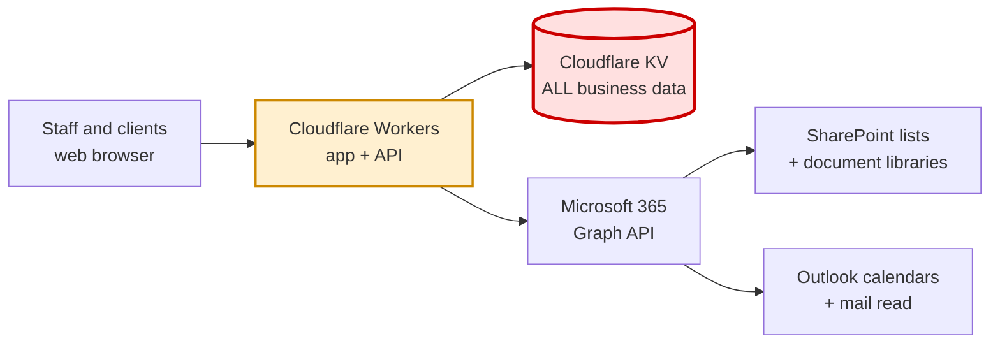

# 1. Executive / Leadership Overview

*Written for non-engineers. No code required.*

---

## What was built

Two products sharing one codebase and one server:

**1. A client-facing financial questionnaire portal.**
Clients of BlueLine Advisors log in and fill out 17 financial assessment questionnaires
(risk tolerance, budget, retirement, net worth, compensation, spending, savings, debt, risk
capacity, behaviour, knowledge, estate documents, beneficiaries, legacy, life insurance,
coverage, long-term care). Advisors choose which questionnaires each client sees. Clients can
also upload requested documents and see a list of external platform links. Clients never see
their own scored results — those render only on the advisor side.

**2. An internal advisor CRM.**
A staff-only application covering contacts and prospects, households/families, tasks and a
kanban board, a calendar, a regulatory compliance tracker (128 seeded obligations), a
learning/SOP library, client document management, and an audit log. This is the larger of the
two products by a wide margin and is where most of the development effort went.

## Who uses it

| Group | Count | Access |
|---|---|---|
| Firm staff (advisors/admin) | 4 named accounts | Full CRM, password + mandatory 2FA |
| Clients | Invitation-only | Their own questionnaires and documents only |
| Public | — | Nothing. No self-service sign-up exists. |

Staff accounts as configured in code: Frank Sabin (owner/super-admin), Jenn Young, an "Intern"
account, and Eric Sullivan. Clients cannot register themselves — an advisor issues a one-time
invitation link for each one.

## Scale and maturity

| Measure | Value |
|---|---|
| Total code | ~38,500 lines |
| Development period | 2026-07-08 to 2026-08-20 (~6 weeks) |
| Commits | 254 |
| Contributors | Effectively one developer, working with AI assistance |
| Third-party code dependencies | **One** (a vendored PDF library) |
| Automated test coverage | Minimal (3 script files, ~2% of behaviour) |

Six weeks is very fast for this much functionality. The code is unusually well-commented —
most non-obvious decisions have a written rationale in-line, which materially reduces handoff
risk. But it was built at speed by one person, and that shows in the areas flagged below.

## What the company depends on

### Vendors

| Vendor | What it provides | If it fails |
|---|---|---|
| **Cloudflare** | Hosting, the application runtime, and **the entire database** (Workers KV) | Total outage. Nothing works. |
| **Microsoft 365** | SharePoint (contact records, documents, compliance, SOP library), Outlook (calendar push, email reading) | Degraded. Core CRM keeps working from Cloudflare's copy; syncing, document upload/download, and calendar push stop. |
| **GitHub** | Source control and the deployment trigger | Cannot deploy. Running site unaffected. |

There is no separate database vendor, no email service provider, no analytics or monitoring
vendor, no error-tracking service, and no payment processor.

### Where the data lives

**All business data is in Cloudflare Workers KV**, a key-value store in the firm's Cloudflare
account. There are 29 distinct record types. Sensitive client records — contacts, tasks, notes,
documents metadata, households, compliance items, and the KYC/suitability block that holds
passport, green-card and driver's-licence numbers plus medical notes — are encrypted before
storage using a key held as a Cloudflare secret.

Some data is also mirrored into the firm's SharePoint, which is the system of record for
contact details, client documents, the compliance tracker, and the learning library.

> **Leadership action item:** encryption is conditional on a secret named
> `DATA_ENCRYPTION_KEY` being configured. If it is not set, that data is stored in plain text
> and the application gives no warning. Whether it is currently set could not be verified
> without Cloudflare console access. **This should be checked.** See
> [14-security-review.md](14-security-review.md), finding H-2.

## Operational needs

**Routine running cost: effectively zero to low.** Cloudflare Workers and KV have generous
free tiers; a 4-user firm will likely stay inside or just above them. Microsoft 365 is
presumably already paid for as the firm's productivity suite.

**One cost caveat:** a scheduled job runs **every 60 seconds**, and each run performs a full
SharePoint contact sync and household sync. That is ~43,200 executions per month plus the
associated KV reads/writes and Graph API calls, largely to detect changes that rarely happen.
This is the single most likely source of unexpected cost or Microsoft API throttling, and the
interval could almost certainly be relaxed to every 5-15 minutes with no user-visible effect.
See [12-deployment.md](12-deployment.md).

**Maintenance burden:** low-to-moderate. No dependency upgrade treadmill (there are almost no
dependencies). The main ongoing work is that any backend change must be made twice — once in
the real backend and once in the PowerShell development mock.

**Deployment:** pushing to the `main` branch on GitHub automatically deploys to production in
1-2 minutes. There is no staging environment, no test gate, and no approval step.

## Principal risks

Ranked by expected harm. Full detail in [14-security-review.md](14-security-review.md) and
[17-technical-debt.md](17-technical-debt.md).

| # | Risk | Severity | Summary |
|---|---|---|---|
| 1 | **Source code is in a public GitHub repository** | High | The complete server logic, data schema, staff email addresses, permission model, and endpoint list are readable by anyone. No credentials are exposed, but this hands an attacker a complete map. For a firm holding client financial data this is very likely unintended. |
| 2 | **Browser security headers do not apply to the live site** | High | The code sets a Content-Security-Policy, clickjacking protection, and HTTPS enforcement — but due to a hosting configuration detail these are applied only to error pages, never to the real application. Verified live. |
| 3 | **Encryption may be inactive** | High if unset | See action item above. |
| 4 | **Single person, single point of knowledge** | High | One developer built all of it in six weeks. These documents are the mitigation; they are not a substitute for a second person who has actually worked in the code. |
| 5 | **No backups of the database** | High | No backup or export mechanism for Cloudflare KV exists anywhere in the codebase or configuration. An accidental deletion or a compromised Cloudflare account means unrecoverable data loss. Nothing schedules an export. |
| 6 | **No staging environment and no deployment gate** | Medium | Every push to `main` goes straight to the live system used by clients. The automated tests are not run by anything automatically, and 2 of the 3 currently fail on a Windows checkout. |
| 7 | **Client portal is on a `workers.dev` URL** | Medium | Clients are asked to log in and upload financial documents at `blueline-portal.fsabin.workers.dev`, not a `blueline-advisors.com` address. This looks like a phishing site to a cautious client and trains clients to trust non-firm domains. A custom domain is straightforward to add. |
| 8 | **Almost no automated tests** | Medium | Regressions are caught by manual checking. The test files that exist assert on source *text* rather than behaviour, so they break when code is reformatted. |
| 9 | **The development mock can drift from production** | Medium | Local testing runs against a hand-written re-implementation. Divergences have already occurred and been fixed; more will appear. |

## Where future investment pays off

In the order I would spend money:

1. **Make the repository private, and add a database backup.** Both are hours of work, not
   weeks, and they address the two risks with the worst downside.
2. **Add a custom domain** (e.g. `portal.blueline-advisors.com`) and fix the security-header
   configuration. Small, high-value, client-trust-facing.
3. **Get a second engineer into the code.** The bus factor is 1. Pair them through the
   [new developer guide](21-new-developer-start-here.md).
4. **Add a staging environment and make the tests run on every push.** This is what converts
   "we hope it works" into "we know it works" before clients see it.
5. **Retire the PowerShell mock** by making `wrangler` work locally (on any x64 machine, or via
   WSL/Docker on the current one). This eliminates a whole category of drift bug and halves the
   cost of every backend change.
6. **Reduce the every-minute cron** to something proportionate.

## What this system is not

Setting expectations honestly:

- It is **not a multi-tenant SaaS product.** Staff identities are hardcoded in source; adding a
  fifth staff member with their own login secret requires a code change and a deploy (though
  admins added through the UI do not).
- It is **not a general-purpose database application.** Workers KV is eventually consistent and
  has no queries, joins, transactions, or referential integrity. Listing operations read many
  keys individually. This is fine at 4 staff and hundreds of contacts; it would need rework at
  thousands.
- The onboarding wizard is **explicitly a proof of concept** and instructs users to enter fake
  data only. It should not be pointed at real clients as-is.
