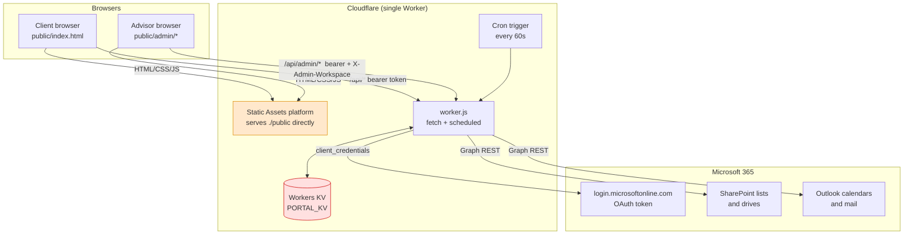
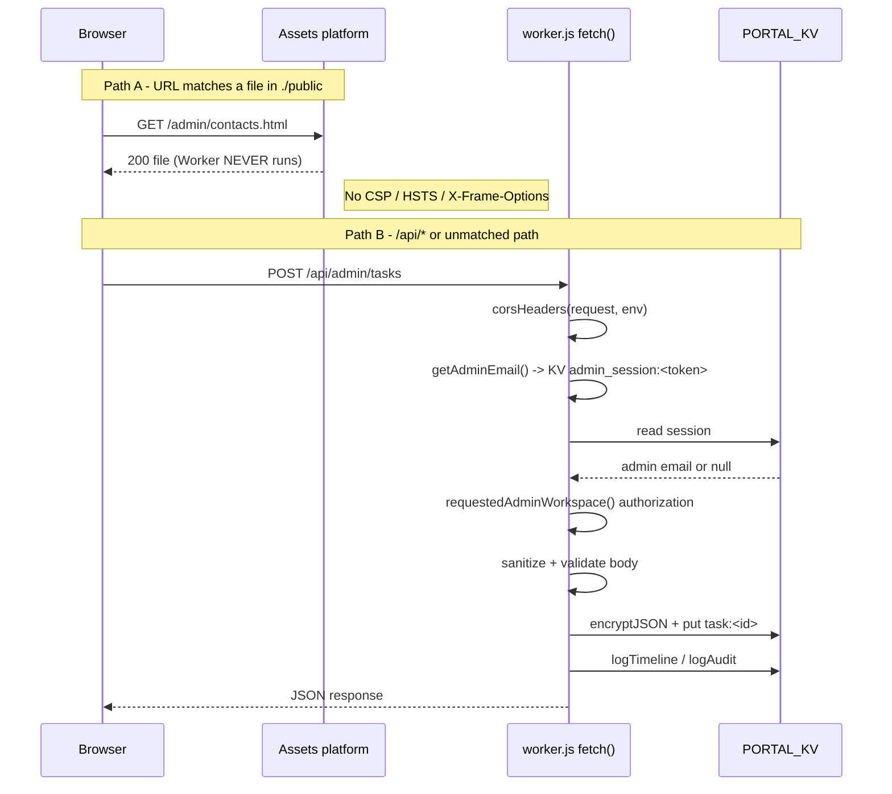
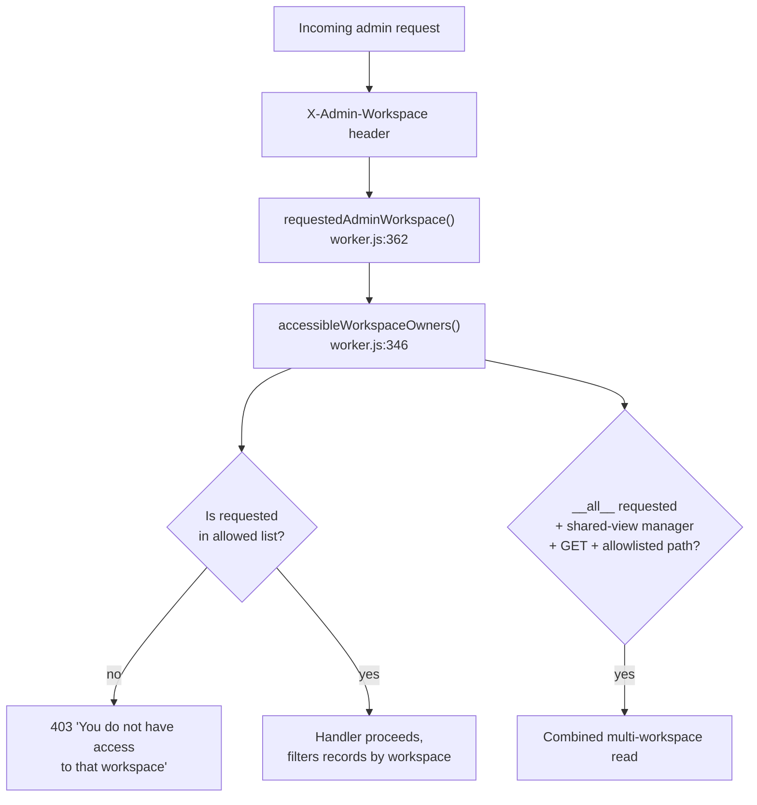

# 2. Architecture and Tech Stack

---

## The stack in one table

| Layer | Technology | Notes |
|---|---|---|
| Runtime | Cloudflare Workers (V8 isolates) | `compatibility_date = "2024-09-23"`, pinned deliberately |
| Backend | One ESM JavaScript module, `worker.js` (8,414 lines) | No framework, no router library |
| Datastore | Cloudflare Workers KV, binding `PORTAL_KV` | Eventually consistent key-value only |
| Static hosting | Cloudflare Workers Static Assets, binding `ASSETS`, directory `./public` | |
| Frontend | Hand-written HTML + CSS + vanilla ES2020 | No React/Vue/build step |
| Auth | Custom: PBKDF2-SHA256 password hashing, bearer tokens in KV, TOTP 2FA for staff | No identity provider |
| Encryption | WebCrypto AES-256-GCM for records at rest | Key from Cloudflare secret |
| Integrations | Microsoft Graph (SharePoint + Outlook) via OAuth client-credentials | One Entra app registration |
| Scheduled work | Cloudflare Cron Trigger, `*/1 * * * *` | Calls `scheduled()` in worker.js |
| Third-party code | `vendor/pdf-lib.esm.min.js` (vendored, not installed) | Only dependency |
| CI/CD | Cloudflare Workers Builds, GitHub App integration | Not GitHub Actions |

**There is no `package.json`.** This is intentional and load-bearing — see the comment at
`worker.js:1-9`, which explains that the PDF library must be imported by relative path because
nothing in the repo can resolve a bare npm specifier.

## System context



> **The most important thing on this diagram** is that browsers reach the Static Assets
> platform *without going through `worker.js`*. This is not a drawing simplification — it is
> how Cloudflare Workers Static Assets behaves when `run_worker_first` is not configured, and
> it has a real security consequence documented in
> [14-security-review.md](14-security-review.md) finding **H-1**.

## Request lifecycle

Two genuinely different paths depending on whether the URL matches a file in `./public`.



### Backend dispatch

`worker.js` has no router library. `export default { fetch }` runs one long `if` chain of
`url.pathname === '...'` and `url.pathname.match(/regex/)` tests (`worker.js:7962-8399`),
falling through to `serveAsset()` at `worker.js:8399`.

**Route ordering is load-bearing.** Several routes must be declared before broader patterns
that would otherwise swallow them. The code documents this in places:

- `worker.js:8054` — household `hh-…` id route declared before `/contacts/:email` routes.
- `worker.js:8238` — `/contacts/:email/(archive|unarchive)` must precede the generic
  `/contacts/(.+)` upsert at `worker.js:8309`, whose `(.+)` would otherwise capture
  `someone@x.com/archive` as the email.
- `worker.js:8228`/`8232` — `portal-invite` and `portal-reset` likewise precede the generic
  contact route.

> **If you add a `/api/admin/contacts/:email/<something>` route, add it above line 8309** or it
> will never be reached. This is the single easiest way to silently break this file.

There is also a workspace-scoping pre-check at `worker.js:8217` (`scopedContactMatch`) and
`worker.js:8281` (`scopedClientItemMatch`) that resolve the owning workspace for sub-resource
routes before the specific handlers run.

## Frontend architecture

**Multi-page application, not a SPA.** Each admin page is a full HTML document with its own
inline `<script>`. There is no client-side router and no shared bundle beyond two files.

```
public/
  index.html          Client portal - ALL client views in one file, toggled by CSS class
  admin.html          Staff login + MFA only. Redirects to /admin/ on success.
  admin/
    index.html        Dashboard ("Home")
    contacts.html     Contacts + Prospects (5,988 lines - the largest page)
    operations.html   Tasks: kanban board + list view
    calendar.html     Calendar
    compliance.html   Compliance tracker
    learning.html     SOP / learning library
    onboarding.html   Onboarding submissions viewer
    settings.html     Admin accounts, portal links, audit log
    tasks.html        20-line redirect stub -> operations.html?view=list
    shared.js         Session guard, api() wrapper, nav shell, shared formatters
    shared.css        Design tokens and component styles
  assets/
    script.js         Client portal logic (1,998 lines)
    render.js         Chart/result renderers - SHARED with the admin side
    style.css, tokens.css
    sign-agreement.js
    vendor/pdf-lib.min.js
  onboarding/         Standalone onboarding wizard (proof of concept)
```

Shared code is loaded by plain `<script src>` tags — no modules, no imports. Everything lives
on the global scope. `public/assets/render.js` is deliberately shared between the client portal
and the admin detail view so scoring/chart logic exists once.

### Frontend state model

- **Session:** `localStorage`. Clients use key `blueline_session`; staff use
  `blueline_admin_session` (`public/admin/shared.js:8`).
- **Selected workspace:** `localStorage`, key `blueline_admin_workspace:<email>`
  (`shared.js:24`). Sent on every admin request as the `X-Admin-Workspace` header.
- **Page state:** module-scoped `let` variables inside each page's inline script. No store, no
  reactivity. Re-render is a manual `render()` call that rewrites `innerHTML`.
- **Polling:** admin pages poll every 30s (`POLL_INTERVAL_MS`). The audit log deliberately does
  *not* poll, to avoid burning KV reads (`settings.html`, and see STATUS.md).

## Caching

| What | Behaviour | Where |
|---|---|---|
| Static assets | `Cache-Control: no-cache` intended (revalidate, not "don't store") | `worker.js:7932-7940` — **but does not apply live**, see security H-1 |
| Graph OAuth token | In-memory per isolate, cached until 60s before expiry | `worker.js:2560-2584`, `graphTokenCache` |
| AES data key | In-memory per isolate, keyed on secret string so rotation re-imports | `worker.js:1096-1113`, `cachedDataKey` |
| Cloudflare edge | `CF-Cache-Status: HIT` observed on assets | Platform default |

Both in-memory caches are per-isolate and vanish on cold start — correct and intentional for
Workers.

## Data flow: the workspace concept

Every business record carries a `workspace` field (an admin's email). This is the multi-tenancy
boundary *within the firm*.



`recordWorkspace()` (`worker.js:319`) defaults any record with no `workspace` field to Frank's
email — so pre-workspace legacy data belongs to Frank rather than becoming invisible.

The `__all__` combined view is deliberately restricted to `GET` on four listing paths only
(`worker.js:364-366`): `/api/admin/workspaces`, `/contacts`, `/households`, `/tasks`. Mutations
can never target `__all__`.

## Cross-cutting backend helpers

Know these six; they appear everywhere.

| Helper | Location | Purpose |
|---|---|---|
| `json(body, status, cors)` | `worker.js:467` | Uniform JSON response with CORS headers |
| `getSessionEmail(request, env)` | `worker.js:558` | Resolve client bearer token -> email |
| `getAdminEmail(request, env)` | `worker.js:782` | Resolve admin bearer token -> email, or null |
| `encryptJSON` / `decryptToObject` | `worker.js:1132` / `1157` | At-rest encryption envelope |
| `logAudit(env, actor, action, detail)` | `worker.js:767` | Append to `audit:` (13-month TTL) |
| `logTimeline(env, client, type, actor, detail)` | `worker.js:6853` | Append to client `timeline:` + `activity:` |
| `listKeys(env, prefix)` | `worker.js:4986` | Paginated KV key enumeration |

`decryptToObject` **throws** rather than returning null when a record is encrypted but
undecryptable (`worker.js:1157-1176`). This is a deliberate fail-closed choice so a missing key
can never be mistaken for "no data" and overwrite real records.

## Relevant files

| Path | Role |
|---|---|
| [`worker.js`](../worker.js) | The entire backend |
| [`wrangler.toml`](../wrangler.toml) | Bindings, cron, observability |
| [`compliance-seed.js`](../compliance-seed.js) | 128 seeded compliance obligations, imported by worker.js |
| [`agreement-pdf-worker.js`](../agreement-pdf-worker.js) | Server-side signed-agreement PDF generation |
| [`vendor/pdf-lib.esm.min.js`](../vendor/pdf-lib.esm.min.js) | Vendored PDF library (the only dependency) |
| [`public/admin/shared.js`](../public/admin/shared.js) | Admin shell, `api()`, session guard |
| [`dev-server.ps1`](../dev-server.ps1) | Local backend re-implementation |
| [`STATUS.md`](../STATUS.md) | 1,680-line running design journal by the original developer |
