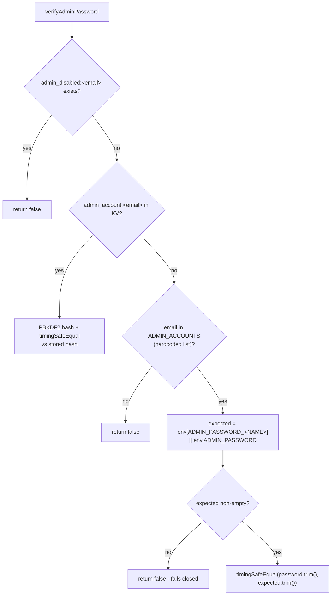
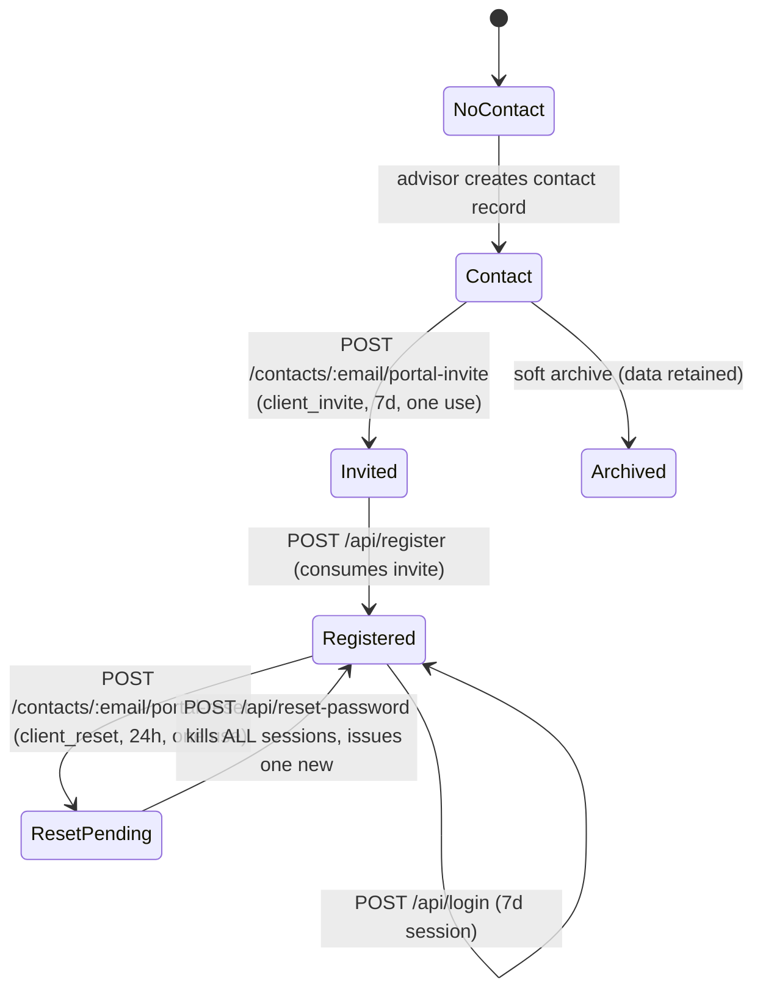

# 6. Authentication, Authorization, and Users

---

## Summary

Entirely custom auth. **No identity provider, no OAuth for user login, no JWTs, no cookies.**
Bearer tokens stored in KV, checked on every request. There is no middleware layer — every
handler calls the auth helper itself as its first statement.

| | Clients | Staff (admins) |
|---|---|---|
| Store | `user:<email>` | `admin_account:<email>` (KV) **or** Cloudflare secret (3 legacy accounts) |
| Password hash | PBKDF2-SHA256, 100,000 iterations, 16-byte random salt | Same for KV admins; **plaintext comparison** for the 3 legacy accounts |
| Min length | 8 (`CLIENT_PASSWORD_MIN_LENGTH`) | 10 (`ADMIN_PASSWORD_MIN_LENGTH`) |
| Second factor | None | **Mandatory TOTP** |
| Session key | `session:<token>` | `admin_session:<token>` |
| Session TTL | 7 days | 12 hours |
| Self sign-up | No — invitation only | No — created by another admin or hardcoded |
| Self password reset | No — advisor issues a link | No — another admin resets, or Cloudflare secret |

## Two ways a staff password can be stored

This is the most confusing part of the system. `verifyAdminPassword` (`worker.js:121-140`):



**Legacy accounts** — hardcoded at `worker.js:85-89`:

| Email | Secret name |
|---|---|
| `fsabin@blueline-advisors.com` | `ADMIN_PASSWORD_FSABIN` |
| `jyoung@blueline-advisors.com` | `ADMIN_PASSWORD_JYOUNG` |
| `intern@blueline-advisors.com` | `ADMIN_PASSWORD_INTERN` |

For these, the password is compared **as plaintext** against a Cloudflare secret — there is no
hashing, because there is nothing hashed to compare against. `timingSafeEqual` is used, so it is
not timing-leaky, and both sides are `.trim()`ed to survive a trailing newline pasted into a
secret. These accounts' passwords **cannot be changed from inside the app**; they are changed in
the Cloudflare dashboard.

**KV admins** — anyone added via Settings -> Add Admin. Salted PBKDF2, resettable in-app.
Eric Sullivan (`esullivan@blueline-advisors.com`) is a KV admin, *not* in `ADMIN_ACCOUNTS`.

**The `ADMIN_PASSWORD` fallback** (`worker.js:135`) is a leftover from migrating off a single
shared staff password. It is a `||` fallback, not an alternative accepted password: if the
individual secret is set, `ADMIN_PASSWORD` is never read.

> **VERIFIED with the account owner (2026-08-20): the `ADMIN_PASSWORD` secret does not exist in
> Cloudflare.** Therefore this branch always evaluates to `''` and the `!!expected` guard makes
> login fail closed. It is dead code and safe to delete. The corollary matters more: **with no
> shared fallback, each of the three legacy accounts requires its own
> `ADMIN_PASSWORD_<NAME>` secret to log in at all.** A missing one produces
> "Invalid email or password" — indistinguishable from a wrong password, so a locked-out staff
> member may believe they forgot their password. Whether `ADMIN_PASSWORD_JYOUNG` and
> `ADMIN_PASSWORD_INTERN` are set is **UNKNOWN** (requires dashboard access).

## Staff login sequence

```mermaid
sequenceDiagram
    participant B as Browser (admin.html)
    participant W as worker.js
    participant KV as PORTAL_KV

    B->>W: POST /api/admin/login {email, password}
    W->>W: rate limit 'adminlogin' 10/5min/IP
    W->>W: verifyAdminPassword()
    alt password wrong
        W-->>B: 401 Invalid email or password
    end
    W->>KV: getAdminMfa(email) [decrypt; THROWS -> 500 fail closed]
    W->>KV: put admin_pending:<token> (10 min TTL)
    W-->>B: {status: 'mfa' | 'enroll', pendingToken}

    alt status = enroll (first time)
        B->>W: POST /api/admin/mfa/enroll {pendingToken}
        W-->>B: {secret (base32), otpauth:// URI, 8 backup codes} ONCE
        Note over B: Secret shown for manual entry - no QR code
    end

    B->>W: POST /api/admin/mfa/verify {pendingToken, code}
    W->>W: TOTP check (+/-1 30s step) OR unused backup code
    W->>KV: delete admin_pending, put admin_session:<token> (12h)
    W->>KV: logAudit 'login' {mfa: 'totp'|'backup-code'}
    W-->>B: {token, email, usedBackup}
```

**Password alone never yields a session.** `handleAdminLogin` returns only a `pendingToken`
(`worker.js:822`). MFA is not optional and cannot be skipped.

**Fail-closed detail worth knowing:** `getAdminMfa` throws if the record is encrypted but
undecryptable. The top-level handler turns that into a 500. So a wrong/missing
`DATA_ENCRYPTION_KEY` locks everyone out rather than silently bypassing MFA
(`worker.js:813-816`). If all staff suddenly get 500s on login, suspect that secret.

**TOTP implementation:** RFC 6238, HMAC-SHA1, 6 digits, 30-second step, +/-1 step tolerance for
clock skew. Validated against the RFC test vectors per `worker.js:838-840`. Backup codes are
SHA-256 hashed and single-use.

## Client login and account lifecycle



- **Registration requires a valid invite bound to that exact email** (`worker.js:588-592`).
  There is no open sign-up. The invite is consumed *before* the session is issued so two
  simultaneous requests cannot both use it.
- **Password reset is advisor-initiated but client-completed.** The admin never sees or sets the
  client's password; they hand over a link and the client chooses. See
  [08-workflows.md](08-workflows.md).
- **Archiving a contact does not delete anything** — tasks, notes, timeline, documents are
  retained.

## Roles

Four effective roles. Only the first three are staff.

| Role | Test | Who |
|---|---|---|
| **Super admin** | `isSuperAdmin(email)` — `worker.js:96`, hardcoded `=== FRANK_ADMIN_EMAIL` | Frank only |
| **Shared firm view manager** | `canManageSharedFirmView()` — `worker.js:340` | Frank + members of Frank's workspace (permanently Jenn, Intern, Eric) |
| **Admin (own workspace)** | `isAdminAccount()` — `worker.js:149` | Any other admin |
| **Client** | valid `session:` token | Portal users |

`isSuperAdmin` is a **hardcoded string comparison to one email address.** Frank's account cannot
be transferred or replaced without editing and redeploying `worker.js`. This is the single most
significant hard-coded assumption in the system.

## Permissions matrix

| Capability | Super admin | Shared-view manager | Own-workspace admin | Client | Enforced at |
|---|---|---|---|---|---|
| Log in to CRM | Yes | Yes | Yes | No | `getAdminEmail` |
| Read/write own workspace records | Yes | Yes | Yes | No | `requestedAdminWorkspace` |
| Read across all workspaces (`__all__`) | Yes | Yes | **No** | No | `worker.js:364-366`, GET + 4 paths only |
| Add an admin account | Yes | Yes | No | No | `handleAdminCreateAdmin:158` |
| Rename an admin | Yes | Yes | No | No | `handleAdminRenameAdmin:217` |
| Reset another admin's MFA | Yes | Yes | No | No | `handleAdminResetMfa` |
| Reset another admin's password | Yes | Yes | No | No | `handleAdminResetPassword` |
| **Remove an admin account** | **Yes only** | No | No | No | `handleAdminDeleteAdmin:231` |
| Manage workspace access | Yes | Yes | No | No | `handleAdminSaveWorkspaceAccess` |
| View firm audit log | Yes | Yes | No | No | `worker.js:2391` |
| Edit firm-wide portal links | Yes | Yes | No | No | `worker.js:7500` |
| Run firm-wide SharePoint sync | Yes | Yes | No | No | `worker.js:7936+` |
| Issue client invite / reset link | Yes | Yes | Yes (own workspace) | No | workspace check only |
| Read own assessments | — | — | — | Yes | `getSessionEmail` |
| Read *other* clients' data | Yes | Yes | Scoped | **No** | `handleGetAssessments` |
| See own scored results | — | — | — | **No, by design** | Client UI shows thank-you only |

Two guards worth noting because they are the only ones of their kind:

- **Frank cannot be removed**: `if (email === FRANK_ADMIN_EMAIL) return 400 'The super-admin
  account cannot be removed'` (`worker.js:233`).
- **Employees can only be assigned to Frank's display**: `handleAdminSaveWorkspaceAccess`
  rejects any owner other than Frank (`worker.js:~420`), and Jenn/Intern/Eric are force-added
  back into the member list on every save — they are permanent shared-view managers and cannot
  be demoted through the UI.

## Workspace isolation (tenancy within the firm)

Every CRM record carries `workspace: <admin email>`. This is *not* a security boundary between
customers — it is a data-visibility boundary between staff.

- An admin assigned to Frank's workspace works **in Frank's workspace only**; their own
  personal workspace becomes non-selectable (dormant, not deleted) until Frank returns them to
  personal (`worker.js:346-360`).
- An unassigned admin sees only their own workspace.
- The header `X-Admin-Workspace` selects the active workspace; `requestedAdminWorkspace`
  (`worker.js:362`) validates it against `accessibleWorkspaceOwners` and returns `null` -> 403.
- `__all__` is a read-only combined view, allowed only for shared-view managers, only on `GET`,
  and only for `/api/admin/workspaces`, `/contacts`, `/households`, `/tasks`.

> **This is authorization by convention, applied per handler.** There is no middleware and no
> row-level security. If a new handler forgets to call `requestedAdminWorkspace`, it leaks
> across workspaces silently. When adding an endpoint, copy an existing handler's first four
> lines verbatim. See [19-common-tasks.md](19-common-tasks.md).

## Enforcement layers

| Layer | Present? | Notes |
|---|---|---|
| Network/WAF | Cloudflare default only | No rules configured in repo |
| Middleware | **None** | Each handler self-checks |
| Route-level auth | Yes, per handler | First 2-4 lines of each handler |
| Object-level auth | Yes, via `workspace` filtering | Manual |
| Row-level security (DB) | **N/A** | KV has no such concept |
| Rate limiting | Yes, 5 scopes | `RATE_LIMITS`, `worker.js:427-433` |
| CSRF protection | Not needed | Bearer tokens in headers, not cookies |
| Client-side gate | Yes | `shared.js` redirects to login on 401 — cosmetic only, not security |

## Rate limits

`worker.js:427-433`, fixed window per IP:

| Scope | Limit | Window | Applied to |
|---|---|---|---|
| `login` | 10 | 5 min | Client login |
| `adminlogin` | 10 | 5 min | Staff login |
| `register` | 5 | 1 hour | Client registration |
| `onboardingStart` | 20 | 1 hour | Onboarding wizard start |
| `reset` | 10 | 5 min | Client password reset submit |

**CONFIRMED:** `/api/admin/mfa/verify` *is* rate limited — it reuses the `adminlogin` scope
(`worker.js:999`), so TOTP brute-forcing is capped at 10 attempts per 5 minutes per IP. With a
6-digit code that is an appropriate control.

Rate limiting is applied at exactly six call sites (`worker.js:568, 667, 713, 791, 999, 2239`).
Everything else — **all authenticated CRUD, every admin endpoint, and `/api/admin/mfa/enroll`** —
is unlimited. That is defensible for authenticated staff endpoints; see security finding L-2 for
the enroll case.

## Session handling gaps

| Gap | Detail |
|---|---|
| No session listing/revocation UI | You cannot see or kill a user's sessions except by resetting their password (which now does kill them). |
| Session tokens stored unhashed | `session:<token>` and `admin_session:<token>` use the raw token as the key. A KV read = account takeover. Contrast with invite/reset tokens, which are hashed. |
| No idle timeout | 12h/7d absolute expiry only. |
| No device/IP binding | A stolen token works from anywhere. |
| Logout is server-side | `handleAdminLogout` deletes the KV session, so it genuinely invalidates. Good. |

## Relevant files

| Path | Contents |
|---|---|
| `worker.js:77-140` | `ADMIN_ACCOUNTS`, `verifyAdminPassword` |
| `worker.js:149-308` | Admin account CRUD, `isAdminAccount`, `allAdminEmails` |
| `worker.js:310-436` | Workspace/permission model |
| `worker.js:507-563` | Crypto helpers: `hashPassword`, `timingSafeEqual`, `randomHex` |
| `worker.js:565-750` | Client auth: register, login, logout, reset |
| `worker.js:753-833` | Admin auth |
| `worker.js:834-1076` | MFA/TOTP |
| `public/admin.html` | Staff login + MFA UI |
| `public/admin/shared.js:8-105` | Session storage, `api()` wrapper, 401 handling |
| `public/assets/script.js:1-60` | Client session + invite/reset token capture |
