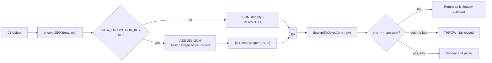
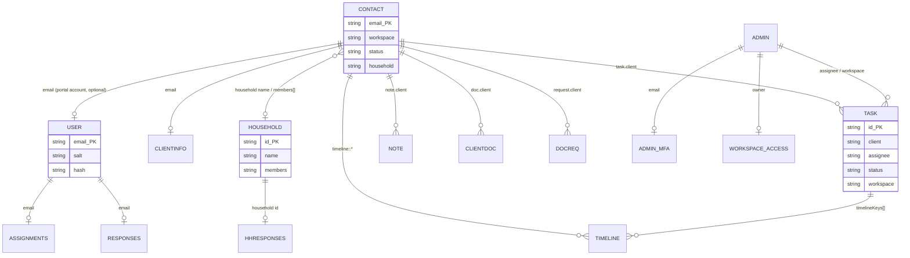

# 7. Data Model

---

## Provider and paradigm

**Cloudflare Workers KV**, bound as `PORTAL_KV` (`wrangler.toml`, namespace id
`dadc7f3c3d66491bbc97ded5efa59bc4`).

There is **no relational database, no ORM, no schema, and no migration system.** Understand
these constraints before designing anything:

| Constraint | Consequence |
|---|---|
| Key-value only | No queries. "List all contacts" = enumerate keys by prefix, then `get()` each one individually. |
| **Eventually consistent** | A write is not guaranteed visible to the next read. This has already caused a real bug — see the household sync note below. |
| No transactions | Multi-key updates can partially fail. No rollback. |
| No referential integrity | A deleted contact leaves its tasks, notes, and timeline entries behind unless code deletes them explicitly. |
| No indexes | Filtering happens in the Worker after reading everything. Sorting relies on key naming tricks. |
| ~25 MB value limit, 512-byte key limit | Large files go to SharePoint, not KV. |

Ordering is achieved by **inverted-timestamp key suffixes** rather than an index: `invTs()`
produces `AUDIT_TS_CEILING - now`, so lexicographically ascending keys are
chronologically descending. This lets the newest N records be read with one bounded
`list({limit})` instead of a full scan. Used by `audit:`, `timeline:`, `activity:`, and `task:`
ids.

## Complete key namespace inventory

29 namespaces. **Enc?** = encrypted at rest via `encryptJSON` (only when `DATA_ENCRYPTION_KEY`
is set — see the warning below).

### Identity and sessions

| Key | Value | Enc? | TTL | Written by |
|---|---|---|---|---|
| `user:<email>` | `{ name, email, salt, hash, iterations, passwordResetAt? }` | No | — | `handleRegister` (694), `handleResetPassword` |
| `session:<token>` | client email (plain string) | No | 7 days | `handleRegister`, `handleLogin`, `handleResetPassword` |
| `admin_account:<email>` | `{ email, name, salt, hash, iterations, createdAt, createdBy, passwordResetAt?, passwordResetBy? }` | No | — | `handleAdminCreateAdmin` (256), `handleAdminResetPassword` |
| `admin_session:<token>` | admin email | No | 12 hours | `handleAdminMfaVerify` (1031) |
| `admin_pending:<token>` | `{ email, ... }` between password and 2FA | No | 10 min | `handleAdminLogin` |
| `admin_mfa:<email>` | `{ secret, confirmed, backupCodes:[{hash,used}], createdAt }` | **Yes** | — | `putAdminMfa` (952) |
| `admin_name:<email>` | display name (plain string) | No | — | `handleAdminRenameAdmin` (230) |
| `admin_disabled:<email>` | `{ email, name, removedAt, removedBy }` | No | — | `handleAdminDeleteAdmin` |
| `admin_workspace_access:<owner>` | `{ members:[email], updatedAt, updatedBy }` | No | — | `handleAdminSaveWorkspaceAccess` |
| `client_invite:<sha256(token)>` | client email | No | 7 days | `handleAdminCreateClientInvite` (630) |
| `client_reset:<sha256(token)>` | client email | No | **24 h** | `handleAdminCreateClientReset` (656) |

> Invite and reset tokens are stored **hashed** (`sha256Hex`), so a KV dump cannot be replayed
> as live links. Session tokens are *not* hashed — a KV read grants session hijack. See
> security finding M-1.

### Client assessment data

| Key | Value | Enc? | TTL | Notes |
|---|---|---|---|---|
| `responses:<email>` | `{ modules: {...} }` | **Yes** | — | Personal assessment answers. Legacy plaintext still readable. |
| `hhresponses:<householdId>` | `{ modules: {...} }` | **Yes** | — | Household-*shared* module answers. See "shared vs personal" below. |
| `assignments:<email>` | array of module keys | No | — | Which modules a client sees. `null`/absent = legacy "all visible". |

### CRM core

| Key | Value | Enc? | Notes |
|---|---|---|---|
| `contact:<email>` | contact record incl. `workspace`, `status`, `household`, `advisor`, `tags`, `importantDates`, `archived` | **Yes** | Round-trips through SharePoint sync |
| `clientinfo:<email>` | KYC/suitability: employment, net worth, tax, **passport / green-card / driver's-licence numbers, medical notes** | **Yes** | Deliberately separate from `contact:` for privacy and to stay out of SharePoint sync |
| `household:<hh-…>` | `{ id, name, kind, members[], keyDocuments, emailPrimary, workspace }` | **Yes** | Id format `hh-<hex>` |
| `task:<id>` | task/meeting: `title`, `status`, `due`, `assignee`, `checklist[]`, `history[]`, `timelineKeys[]`, `calendarOwners[]`, `outlookEvents{}` | **Yes** | Id = `<invTs>-<hex4>` |
| `note:<id>` | note record | **Yes** | |
| `clientdoc:<id>` | document metadata (the file itself lives in SharePoint) | **Yes** | |
| `docreq:<id>` | outstanding document request | **Yes** | |
| `board_lists` / per-workspace variant | `{ lists:[{id,type,account?,name?}] }` | **Yes** | Kanban columns; `boardListsKey(workspace)` |
| `portal_links` | `{ links:[...] }` | **Yes** | Client-facing external platform links |
| `compliance_items` | `{ version:1, items:[...] }` | **Yes** | Single blob, seeded from `compliance-seed.js` (128 rows) |

### History and audit

| Key | Value | Enc? | TTL |
|---|---|---|---|
| `timeline:<email>:<invTs>-<hex>` | `{ ts, client, type, actor, detail }` | **Yes** | — (permanent) |
| `activity:<invTs>-<hex>` | same entry, firm-wide feed | **Yes** | ~13 months |
| `audit:<invTs>:<hex>` | `{ ts, email, action, detail }` | No | ~13 months |
| `notif_seen:<adminEmail>:<workspace>` | ISO timestamp | No | — |

`logTimeline` (`worker.js:6853`) writes the **same encrypted entry twice** — once under
`timeline:<email>:` for the contact's Timeline tab, once under `activity:` for the firm-wide
feed — and returns both keys so the owning record can store them in `timelineKeys[]` and clean
them up on delete (`deleteTimelineRefs`, `worker.js:6878`).

### Onboarding (proof of concept)

| Key | Value | Enc? | TTL |
|---|---|---|---|
| `onboarding:<BLA-ONB-YYYY-xxxx>` | full wizard record incl. `data{}`, `clientEmail`, signature data URL | **NO — plaintext** | 30 days on soft-delete |
| `onboarding_secret:<id>` | per-session write token | No | 30 days |

> **Onboarding records are the only client-data namespace stored in plain text**
> (`worker.js:2261, 2329, 2431, 2452`). This is consistent with the wizard being an explicit
> proof of concept that tells users *"Use fake/test data only — no real personal details, no
> SSNs"* (`public/onboarding/index.html:131`) and labels the DOB field *"(fake data only)"*.
> The risk is entirely that someone ignores that instruction. See security finding **M-2**.

### Infrastructure

| Key | Value | Enc? | TTL |
|---|---|---|---|
| `rl:<scope>:<ip>` | `{ count, windowStart }` | No | = window |
| `autotask:<rule>:<client>` | `'1'` marker so an automation fires once | No | — |
| `sharepoint:contact-fields:excluded` | excluded-field config | No | — |

## Encryption

**Key derivation** (`getDataKey`, `worker.js:1099`): the secret is SHA-256 hashed to produce a
256-bit AES key. Any-length secret works. The imported key is cached per isolate and re-imported
if the secret string changes.

> **CRITICAL OPERATIONAL WARNING** (the code says this too, `worker.js:1090-1093`):
> if `DATA_ENCRYPTION_KEY` is lost or changed after real data is encrypted, **that data is
> permanently unreadable.** There is no key escrow, no re-encryption migration, and no backup.
> Never rotate this secret without first writing and testing a re-encryption script.

> **If the secret is not set, everything above silently writes plaintext.** `encryptJSON`
> returns bare `JSON.stringify` output with no warning, no log line, and no admin-visible
> indicator. Whether it is set in production **could not be verified** without Cloudflare
> console access. Checking this is the single highest-value verification available to whoever
> receives this handoff.

**Acknowledged limitation** (also stated in-code): the key lives in the same Cloudflare account
as the data, so this protects against a leaked KV export or stolen read token — **not** against
compromise of the Cloudflare account itself. Account MFA is the control for that.

## Entity relationships

There are no foreign keys; these are conventions enforced (or not) by code.

**The `workspace` field is on every CRM record** and is the tenancy boundary. `recordWorkspace()`
(`worker.js:319`) defaults a missing value to Frank's email, so legacy pre-workspace records
belong to Frank rather than disappearing.

## Shared vs personal assessments

A genuinely subtle rule (`worker.js:1937-2136`). Some modules are household-shared (one answer
for the family), others personal (one answer per person).

- Personal answers -> `responses:<email>`
- Shared answers -> `hhresponses:<householdId>`
- `splitModules(modules)` separates them; `handleSaveAssessment` writes to whichever key
  applies (`worker.js:2081-2097`).
- When aggregating a household's progress, an **unregistered** member (no `user:` record) is
  given an explicit empty assignment list rather than the legacy "everything visible" default
  (`worker.js:2171-2181`). This is the behaviour `scripts/test-portal-regressions.js` guards.

## Eventual consistency: a real bug that already happened

Documented in `scripts/test-household-sync.js` and worth reading in full before touching sync:

> Saving a household pushes it to SharePoint, which bumps that row's `Modified` to now. The
> every-minute pull then sees SharePoint as newer than the copy it reads, and rebuilds the
> record from it. **KV is eventually consistent, so that copy can still be the pre-save one**,
> and rebuilding from a stale base wipes every field SharePoint has no column for —
> `keyDocuments`, `kind`, `emailPrimary`, `members`. Symptom: a key-document date set in the UI
> reverts to "Not recorded" about a minute later.

This class of bug is inherent to the write-through-then-poll design plus a 60-second cron.
Treat any "my change reverted itself after a minute" report as this pattern first.

## CRUD callers by namespace

| Namespace | Read by | Written by | Deleted by |
|---|---|---|---|
| `contact:` | `handleAdminContacts`, `contactBelongsToWorkspace`, sync | `handleAdminUpsertContact`, `syncSharePointContacts` | `handleAdminArchiveContact` (soft) |
| `task:` | `handleAdminListTasks` | `createTask`, `handleAdminUpdateTask` | `handleAdminDeleteTask` |
| `clientinfo:` | `handleAdminGetClientInfo` | `handleAdminUpdateClientInfo` | — |
| `household:` | `handleAdminListHouseholds` | `handleAdminCreateHousehold`, `handleAdminUpdateHousehold`, `syncSharePointHouseholds` | `handleAdminDeleteHousehold` |
| `responses:` | `handleGetAssessments`, `handleAdminClients` | `handleSaveAssessment` | — |
| `compliance_items` | `handleAdminComplianceList` | `handleAdminComplianceCreate/Update/Import` | `handleAdminComplianceDelete` |
| `audit:` | `handleAdminAudit` | `logAudit` | TTL only |

## What has no delete path

Records that accumulate with no cleanup mechanism. At current scale this is harmless; note it
before scaling.

- `user:` — deleting a contact does not delete their portal account.
- `assignments:` — orphaned when a client is removed.
- `responses:` / `hhresponses:` — never deleted.
- `timeline:` — permanent by design (no TTL), unlike `activity:`.
- `clientinfo:` — no delete handler exists.
- `rl:` and `autotask:` — TTL/marker only.

**There is no backup or export of any of this.** See [12-deployment.md](12-deployment.md).
