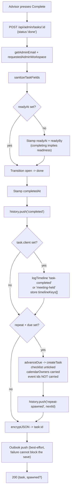
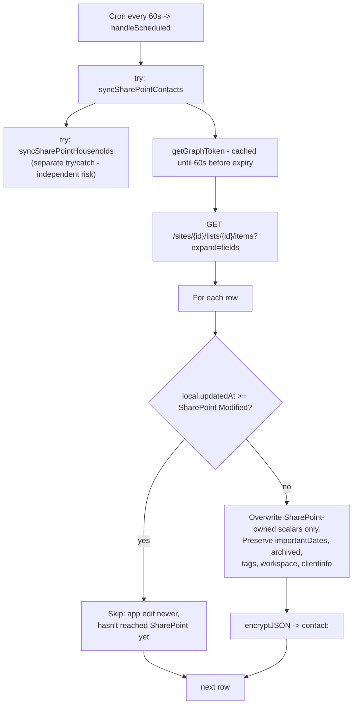
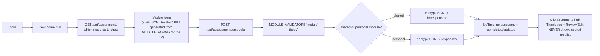

# 8. Major Workflows — End-to-End Traces

Each trace follows: UI -> validation -> API -> auth -> business logic -> storage/integration ->
response -> final state.

---

## 1. Client onboarding: invite to first login

**Actors:** advisor, client.

```mermaid
sequenceDiagram
    participant A as Advisor (contacts.html)
    participant W as worker.js
    participant KV as PORTAL_KV
    participant C as Client (index.html)

    A->>W: POST /api/admin/contacts/:email (create contact)
    W->>KV: encryptJSON -> contact:<email>
    A->>W: POST /api/admin/contacts/:email/portal-invite
    W->>W: workspace check; 409 if user:<email> exists
    W->>KV: put client_invite:<sha256(token)> = email (7d TTL)
    W->>KV: logAudit 'create-client-invite'
    W-->>A: {invite: token}
    Note over A: Page opens /?invite=<token>&email=<addr><br/>in a NEW TAB
    C->>C: script.js captures token, strips it from URL,<br/>clears any session, switches to Create Account,<br/>locks the email field
    C->>W: POST /api/register {name,email,password,invite}
    W->>W: rate limit 'register' 5/hr/IP
    W->>W: verify invite hash maps to THIS email
    W->>KV: delete invite (consume BEFORE session)
    W->>KV: put user:<email> (PBKDF2), put session:<token>
    W->>KV: logTimeline 'account-created'
    W-->>C: {token, name, email} -> enterApp()
```

**Final state:** `contact:` + `user:` + `session:` exist; invite gone; timeline and audit entries
written.

**Failure modes:** 403 invalid/expired/mismatched invite; 409 account exists; 400 password < 8;
429 rate limit.

> **Note the design quirk:** the invite flow *opens the registration link in the advisor's
> browser*, meaning the advisor typically fills in the client's initial password. The password
> **reset** flow (below) deliberately does the opposite.

**Files:** `contacts.html:3064-3086`, `worker.js:608-626` (invite), `worker.js:565-607`
(register), `public/assets/script.js:1-25, 283-303`.

---

## 2. Client password reset (advisor-initiated, client-completed)

Added 2026-08-20. The security property is that **the advisor never sees the password.**

```mermaid
sequenceDiagram
    participant A as Advisor
    participant W as worker.js
    participant KV as PORTAL_KV
    participant C as Client

    A->>W: POST /api/admin/contacts/:email/portal-reset
    W->>W: workspace check; 409 if NO user:<email>
    W->>KV: put client_reset:<sha256(token)> = email (24h)
    W->>KV: logAudit 'create-client-reset'
    W-->>A: {reset: token}
    Note over A: Modal SHOWS the link for the advisor to send.<br/>Deliberately NOT opened here.<br/>Field blanks on close.
    C->>C: Opens /?reset=…  token stripped from URL,<br/>held in module scope only,<br/>tabs + other forms hidden
    C->>W: POST /api/reset-password {token, password}
    W->>W: rate limit 'reset'; validate TOKEN first, then password
    W->>KV: re-hash user:<email>; delete reset token
    W->>KV: DELETE every session:* for this client
    W->>KV: put one new session; logTimeline 'password-reset'
    W-->>C: {token} -> signed straight in
```

| Design decision | Reason |
|---|---|
| Advisor gets a link, not a password field | Only the client should ever know their credential. These are external users whose data is encrypted PII. |
| Link not opened in the advisor's browser | Opening it would let the advisor set the password, defeating the point |
| Modal blanks on close | A live token should not sit in the DOM of a tab left open all day |
| All existing sessions killed | A reset prompted by a shared/compromised password must end the sessions that prompted it |
| Token validated **before** password length | The reverse tells someone with a dead link to fix their password first, then fails them again on the link — two round trips and a misleading first message |
| A rejected password does **not** consume the token | A typo must not strand the client |
| 24h TTL, vs 7d for invites | A reset link takes over an account that already holds client data |

**Files:** `worker.js:628-712`, `contacts.html` (button + `pwreset-*` modal),
`public/index.html` (`#reset-form`), `public/assets/script.js`.

---

## 3. Staff login with mandatory MFA

See [06-auth-and-permissions.md](06-auth-and-permissions.md) for the full sequence diagram.

Summary: `POST /api/admin/login` returns only a `pendingToken` (10-min TTL) plus
`status: 'mfa' | 'enroll'`. **A password alone never produces a session.** `mfa/enroll` mints a
base32 secret and 8 single-use backup codes, returned once. `mfa/verify` accepts a TOTP (+/-1
30-second step) or an unused backup code, then issues a 12-hour `admin_session:` and audit-logs
the method used.

Fail-closed: if `admin_mfa:` cannot be decrypted, the handler throws -> 500. Nobody gets in
without MFA.

---

## 4. Completing a task (the most side-effectful write)



**Final state:** task `done` with both timestamps and a history entry; a client timeline +
activity entry; possibly a brand-new task record; possibly Outlook events.

**Then:** 7 days later the task silently disappears from the Tasks page (view filter only — the
record and its timeline stay). See [16-business-rules.md](16-business-rules.md).

**Files:** `worker.js:7200-7460`, `operations.html:1384-1400`.

---

## 5. SharePoint contact sync (the cron path)



**Conflict rule:** last-writer-wins by timestamp, per record. The push side applies the mirror
rule and skips if SharePoint is already newer than what the app knew.

> **The failure mode to remember.** Because KV is eventually consistent, the pull can read a
> *pre-save* copy of a record it just pushed, decide SharePoint is newer, and rebuild from a stale
> base — wiping app-only fields (`keyDocuments`, `kind`, `emailPrimary`, `members`). **Symptom:
> "my change reverted itself about a minute later."** `scripts/test-household-sync.js` pins the
> fix (strip `undefined` before spreading, so a blank SharePoint `Title` never blanks a real
> name) and passes.

**Files:** `worker.js:2544-3361`, `7901-7916`; `scripts/test-household-sync.js`.

---

## 6. Client document upload (chunked, to SharePoint)

```mermaid
sequenceDiagram
    participant B as Browser
    participant W as worker.js
    participant SP as SharePoint (Graph)
    participant KV as PORTAL_KV

    B->>W: POST /contacts/:email/documents/upload {name, size}
    W->>W: auth + workspace; reject size > 250 MB
    W->>SP: create upload session
    W->>W: encryptJSON the ticket (client cannot tamper with the path)
    W-->>B: {ticket, chunkSize: 5 MB}
    loop each 5 MB chunk
        B->>W: PUT /admin/client-documents/chunk {ticket, chunk}
        W->>W: decrypt + validate ticket
        W->>SP: PUT chunk to the session URL
    end
    SP-->>W: completed driveItem
    W->>KV: encryptJSON -> clientdoc:<id> (metadata only)
    W->>KV: logTimeline
    W-->>B: 200 {document}
```

**The file itself never touches KV** — only metadata. 5 MB chunks because Graph requires a
multiple of 320 KiB.

**Failures:** chunk failure aborts the upload and may leave a partial file in SharePoint; there
is no resume and no cleanup. Client-side uploads follow the same shape via
`/api/documents/upload` + `/api/documents/chunk`.

**Files:** `worker.js:5440-5960` (admin), `5961-6281` (client-side + document requests).

---

## 7. Client fills in an assessment



**Files:** `worker.js:1168-2136`, `public/assets/script.js`, `public/assets/render.js`.

---

## 8. Adding and removing a staff account

**Add** (`POST /api/admin/admins`, shared-view managers): validates email/name/password >= 10,
409 if the email is already an admin (checked against **both** the hardcoded roster and KV so the
two lists cannot collide), writes salted PBKDF2 to `admin_account:`, clears any
`admin_disabled:` tombstone, audit-logs `create-admin`. **No MFA record is created** — they
enrol on first login like anyone else. The password is handed over directly; there is no email
invite.

**Remove** (`DELETE /api/admin/admins/:email`, **Frank only**) — the most side-effectful handler
in the file:

1. 400 if the target is Frank (super-admin cannot be removed)
2. Write `admin_disabled:<email>` tombstone (name, who, when)
3. Preserve the display name under `admin_name:`
4. Delete `admin_account:` and `admin_mfa:`
5. Delete **every** `admin_session:` and `admin_pending:` for that email -> immediate sign-out
6. Strip them from every `admin_workspace_access:` member list
7. Audit-log `remove-admin`

Historical workspace data is deliberately retained.

**Reset a staff password** (`POST /api/admin/admins/:email/reset-password`): works only for
KV-backed admins. **400 for the three hardcoded accounts** — their password is a Cloudflare
secret, so the UI instead displays the dashboard path
(`ADMIN_PASSWORD_<NAME>`) and never calls the API. Enforced server-side too, so it is not merely
a UI distinction. Kills that admin's sessions; leaves MFA intact.

**Files:** `worker.js:155-274`, `settings.html`.

---

## 9. Onboarding wizard (proof of concept)

```mermaid
sequenceDiagram
    participant C as Client (/onboarding/)
    participant W as worker.js
    participant KV as PORTAL_KV

    C->>W: POST /api/onboarding/start (client session required)
    W->>W: rate limit 'onboardingStart' 20/hr/IP
    W->>KV: put onboarding_secret:<id> = writeToken (30d)
    W->>KV: put onboarding:<id> (PLAINTEXT)
    W-->>C: {onboardingId, writeToken}
    loop each step
        C->>W: POST /api/onboarding/:id + X-Onboarding-Token
        W->>W: id regex; token match; <= 100 KB; validate signature PNG prefix
        W->>KV: put onboarding:<id> (PLAINTEXT)
    end
```

**Dual authorization:** the client session proves *who*; the per-session write token prevents one
browser session editing another's record. Ids are random (`BLA-ONB-YYYY-<hex8>`) rather than
sequential — the code notes this avoids both a non-atomic KV counter race and enumeration.

> Records are stored **unencrypted** — the only client-data namespace that is. Consistent with the
> wizard telling users *"Use fake/test data only — no real personal details, no SSNs."* See
> security finding M-2.

Admin side: `GET /api/admin/onboarding`, soft delete with 30-day TTL, and restore.

**Files:** `worker.js:2219-2543`, `public/onboarding/*`, `public/admin/onboarding.html`.

---

## 10. Compliance sign-off

Load `compliance_items` (a single blob of all 128) -> filter client-side -> advisor signs off as
owner or reviewer -> `POST /api/admin/compliance/:id` -> the whole blob is rewritten ->
optionally pushed to Outlook.

Because recurring obligations are **materialised** (one record per due date), each occurrence
carries its own pair of sign-offs — which is what compliance evidence requires.

> Two things that look wrong but are not: the app never generates the next occurrence (future
> dates arrive by spreadsheet import), and the "Open" count stays flat because seeded rows lack a
> `seriesId`.

> One thing that **is** wrong: the single-blob store has a lost-update race — two admins signing
> off simultaneously can silently lose one edit. Security finding M-4.

**Files:** `worker.js:4165-4957`, `public/admin/compliance.html`, `compliance-seed.js`.
