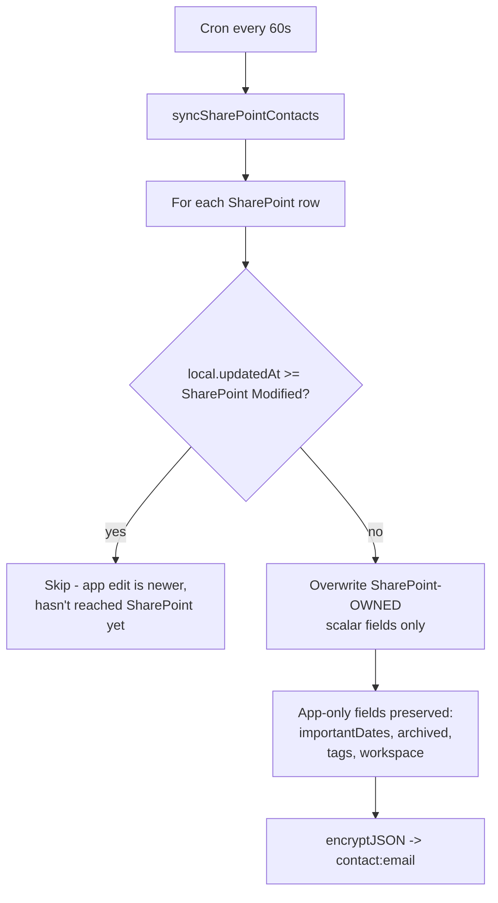

# 9. External Integrations

There is exactly **one** external integration: **Microsoft Graph**, used for both SharePoint and
Outlook. No other third-party service is contacted. External hosts appearing in `worker.js`:
`graph.microsoft.com` (38 references) and `login.microsoftonline.com` (1, for the token).

---

## Authentication

**One Entra ID (Azure AD) app registration** serves everything, using the OAuth 2.0
**client-credentials** flow — an application identity, not a delegated user.

```js
// worker.js:2565-2584
POST https://login.microsoftonline.com/{OUTLOOK_TENANT_ID}/oauth2/v2.0/token
  client_id={OUTLOOK_CLIENT_ID}
  client_secret={OUTLOOK_CLIENT_SECRET}
  scope=https://graph.microsoft.com/.default
  grant_type=client_credentials
```

The token is cached in-module (`graphTokenCache`, `worker.js:2560-2584`) until 60 seconds before
expiry, keyed so a changed secret forces a re-fetch. Per-isolate; lost on cold start.

> **Naming trap.** The variables are called `OUTLOOK_*` but they authenticate **all** Graph
> access including SharePoint. There is no `SHAREPOINT_CLIENT_ID`. The app registration is named
> `BlueLineSyncOutlook` (per project history) and was reused for SharePoint rather than creating
> a second one. Do not go looking for separate SharePoint credentials — there are none.

**Required Graph application permissions** (admin consent needed):

| Permission | Needed for | Confidence |
|---|---|---|
| `Sites.ReadWrite.All` (or narrower `Sites.Selected`) | SharePoint lists and drives | **INFERRED** from the endpoints called |
| `Calendars.ReadWrite.All` | Outlook calendar push | **CONFIRMED** — stated at `worker.js:6893-6894` |
| `Mail.Read` | Reading client emails (`/contacts/:email/emails`) | **INFERRED** from `GET /users/{id}/messages` |

The actual granted permission set **could not be verified** without Entra portal access. If any
integration returns 403, check consent first.

## SharePoint

### What it is used for

| Feature | SharePoint object | Env var |
|---|---|---|
| Contacts sync (two-way) | A list | `SHAREPOINT_LIST_ID` |
| Households sync (two-way) | A list | `SHAREPOINT_HOUSEHOLDS_LIST_ID` |
| Compliance tracker | A list | `SHAREPOINT_COMPLIANCE_LIST_ID` (+ `SHAREPOINT_COMPLIANCE_SITE_ID`) |
| Learning / SOP library | A document library | `SHAREPOINT_LEARNING_LIST_ID` |
| Client documents | A document library | `SHAREPOINT_CLIENT_DOCS_LIST_ID` |
| Notes | A list | `SHAREPOINT_NOTES_LIST_ID` |
| Site resolution | — | `SHAREPOINT_SITE_ID` |

### Sync model: pull-with-merge, both directions

The most operationally important logic in the integration (`worker.js:2648-2720`).



**Last-writer-wins by timestamp, per record, per field group.** Whichever side has the newer
`Modified`/`updatedAt` wins for the SharePoint-owned scalar fields. Fields SharePoint has no
column for are always preserved from the local record.

The push side applies the mirror-image rule (`worker.js:2707-2710`): if SharePoint's `Modified`
is already newer than what the app knew when the edit was made, the push is skipped.

> **This design has a known failure mode.** See [07-data-model.md](07-data-model.md) and
> `scripts/test-household-sync.js`: because KV is eventually consistent, the pull can read a
> *pre-save* copy of a record it just pushed, conclude SharePoint is newer, and rebuild from a
> stale base — wiping app-only fields. Symptom: **"my change reverted itself about a minute
> later."** Treat every such report as this bug first. `test-household-sync.js` exists
> specifically to pin the fix (strip undefined before spreading) and passes.

### Field ownership

`worker.js:2587-2600` defines which scalar contact fields SharePoint owns and may overwrite.
Explicitly **not** SharePoint-owned: `importantDates`, `archived`/`archivedAt`/`archivedBy`, and
(critically) `clientinfo:` which is a separate KV record precisely so it never enters this code
path.

### Chunked uploads

Both document libraries use Graph upload sessions:

| | Chunk size | Max file |
|---|---|---|
| Client documents | 5 MB (`CLIENT_DOC_CHUNK`) | 250 MB (`CLIENT_DOC_MAX`) |
| Learning library | 5 MB (`LEARNING_UPLOAD_CHUNK`) | 2 GB (`LEARNING_MAX_UPLOAD`) |

5 MB is chosen as a multiple of the 320 KiB Graph requires — the code says so at
`worker.js:3666` and `5460`. **Do not change these to arbitrary values**; Graph rejects
non-conforming chunk sizes.

The upload ticket handed to the browser is itself `encryptJSON`-wrapped (`worker.js:3775`,
`5776`), so a client cannot tamper with the target path.

### Known SharePoint constraints (learned the hard way)

From project history and in-code comments:

- **Graph cannot write SharePoint *Choice* columns reliably.** The learning library's tags were
  moved to a **plain-text column** for this reason. Do not "fix" this back to a Choice column.
- `/api/admin/learning/fields` exists to report the resolved column config, including whether
  `allowTextEntry` is set, so this is inspectable without the SharePoint admin UI.
- Word locks `.docx` files while open, which can make uploads fail — an operational gotcha, not
  a code bug.

## Outlook

**Push-only. Outlook is never read back for calendar data; this app is the source of truth.**
(`worker.js:6891-6892`)

| Aspect | Behaviour |
|---|---|
| Trigger | Saving a task/meeting with `calendarOwners` set |
| Target | `POST/PATCH /users/{owner}/events` — any number of staff mailboxes per meeting |
| Attendees | **Deliberately none.** See below. |
| Timezone | `OUTLOOK_TIMEZONE`, default `Eastern Standard Time` |
| Default duration | 60 minutes (`OUTLOOK_DEFAULT_DURATION_MIN`) |
| Event ids | Stored on the task as `outlookEvents{}` so updates patch rather than duplicate |
| Failure | Caught and logged; **never blocks saving the meeting** |

> **Why no attendees** (`worker.js:6896-6899`): Graph emails an invitation to every attendee it
> is given. Listing the client would fire real mail at them the moment an advisor saved a
> meeting — a side effect a save must never have. Events are private calendar entries; inviting
> people stays a manual step in Outlook. **Do not "improve" this by adding attendees** without
> deciding deliberately that client emails should fire on save.

There is also a compliance -> Outlook push (`worker.js:4303+`,
`POST /api/admin/compliance/outlook-sync`) that mirrors compliance due dates onto calendars.

Recurring-task occurrences deliberately do **not** copy the previous occurrence's Outlook event
ids, so the new occurrence creates fresh events instead of overwriting the completed one's
(`worker.js:~7420`).

## Email reading

`GET /api/admin/contacts/:email/emails` -> `handleListClientEmails` calls
`GET /users/{id}/messages` to surface recent correspondence with a client on their contact page.
Read-only. **The application never sends email.** See
[13-storage-and-notifications.md](13-storage-and-notifications.md).

## Configuration gating

Every integration checks its own configuration before acting, e.g.:

```js
function outlookConfigured(env) {
  return !!(env.OUTLOOK_CLIENT_ID && env.OUTLOOK_CLIENT_SECRET && env.OUTLOOK_TENANT_ID);
}
```

If unconfigured, the feature is skipped rather than erroring. **This means a missing secret
presents as a silently missing feature, not an error message** — a real diagnosability problem.
See [18-troubleshooting.md](18-troubleshooting.md).

## Failure behaviour

| Failure | Effect | Recovery |
|---|---|---|
| Graph token request fails | `throw new Error('Failed to get Graph token: ' + statusText)`. Sync logs and continues; the two syncs have separate try/catch so one failing doesn't skip the other (`worker.js:7908-7909`). | Automatic next minute |
| SharePoint list unreachable | Sync fails, logged to Cloudflare Logs. **CRM keeps working from the KV copy.** | Automatic |
| Outlook push fails | Caught, logged. Meeting still saves. | Manual re-save |
| Document upload fails mid-chunk | Upload aborts; partial file may remain in SharePoint | Retry upload |
| Client secret expired | All Graph features stop; CRM core unaffected | Rotate secret in Cloudflare |
| Encrypted upload ticket undecryptable | 500 | Restart upload |

**The architecture is resilient here by design:** KV is the primary store and SharePoint is a
mirror, so Microsoft being unavailable degrades rather than breaks the product. See
[20-failure-impact.md](20-failure-impact.md).

## Security implications

- The client-credentials app identity is **not** scoped per-user. Any Graph call the Worker makes
  runs with full application permissions. A bug in path construction could in principle reach
  other SharePoint content in the tenant. Consider `Sites.Selected` to constrain the blast radius.
- `Mail.Read` at application scope means the Worker can read **any** mailbox in the tenant, not
  just clients'. The code only ever requests specific contact addresses, but the permission is
  broader than the use.
- Upload tickets are encrypted, preventing client-side path tampering. Good.
- Rotating `OUTLOOK_CLIENT_SECRET` is a normal, safe operation (unlike `DATA_ENCRYPTION_KEY`) —
  it breaks nothing permanently.

## Relevant files

| Location | Contents |
|---|---|
| `worker.js:2544-3361` | SharePoint contacts sync (`getGraphToken`, field ownership, pull/push) |
| `worker.js:3362-3647` | Learning library reads |
| `worker.js:3648-3916` | Learning uploads |
| `worker.js:4303-4957` | Compliance -> Outlook |
| `worker.js:5440-5960` | Client documents |
| `worker.js:6887-7466` | Outlook calendar push |
| `worker.js:7901-7916` | `handleScheduled` — the cron entry point |
| `scripts/test-household-sync.js` | Regression test for the stale-base clobbering bug |
