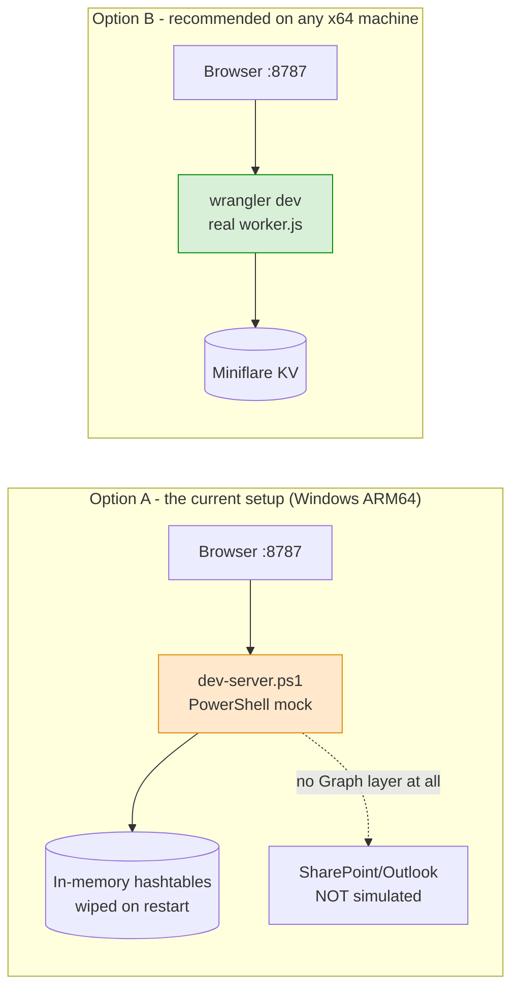

# 11. Local Development

---

## The unusual bit, up front

**You cannot run the real backend locally on the original developer's machine.** Cloudflare's
local runtime (`workerd`) has no `win32-arm64` build, so `wrangler` cannot even install there.

The workaround is `dev-server.ps1` — a **3,265-line hand-written PowerShell re-implementation of
the entire backend**, serving the same API surface on port 8787 from in-memory hashtables.



> **If you have an x64 machine, or WSL/Docker, use `wrangler dev` instead.** You will be running
> the actual code that ships. The PowerShell mock exists solely to work around a hardware
> limitation and is the single largest source of "works locally, breaks in production" risk in
> this project. Retiring it is recommended in
> [17-technical-debt.md](17-technical-debt.md).

## Prerequisites

| Tool | Needed for | Notes |
|---|---|---|
| PowerShell 5.1+ | `dev-server.ps1` | Ships with Windows. Uses `System.Net.HttpListener`. |
| Node.js | Running `scripts/test-*.js` | Verified with v24.18.0. Not needed to serve the app. |
| A browser | — | |
| `wrangler` (optional) | `wrangler dev`, secret management, real deploys | **Will not install on win32-arm64** |
| `gh` (optional) | GitHub operations | |

**No `npm install`. There is no `package.json`.** Clone and run.

## Running the mock backend

```bash
powershell -NoProfile -ExecutionPolicy Bypass -File dev-server.ps1
```

Serves `http://localhost:8787` — both the API and the static files from `./public`.

Expected startup output:

```
Mock portal server on http://localhost:8787/
  compliance items loaded: 128
```

If you see anything else, or nothing, the script failed to parse. Validate without running:

```bash
powershell -NoProfile -Command "$e=$null; [System.Management.Automation.Language.Parser]::ParseFile((Resolve-Path 'dev-server.ps1').Path, [ref]$null, [ref]$e) | Out-Null; if($e.Count){ $e | ForEach-Object { $_.Message }; exit 1 } else { 'OK' }"
```

## Logging in locally

**MFA is real in the mock** — you must compute a genuine TOTP code. This is the most
awkward part of local development and is worth scripting once.

Dev credentials (`dev-server.ps1:38-43` — dev-only, not production values):

| Email | Password |
|---|---|
| `fsabin@blueline-advisors.com` | `dev-fsabin-pass` |
| `jyoung@blueline-advisors.com` | `dev-jyoung-pass` |
| `intern@blueline-advisors.com` | `dev-intern-pass` |
| `esullivan@blueline-advisors.com` | `dev-esullivan-pass` |

Procedure:

1. Go to `http://localhost:8787/admin.html`, submit email + password.
2. Because MFA state is in memory and wiped on restart, you get the **enrolment** screen every
   time. It displays a fresh base32 secret, e.g. `SRRI NTGO 5CM2 ...`.
3. Compute the current 6-digit TOTP for that secret and submit it.

A working TOTP generator (Node, no dependencies):

```js
// usage: node totp.js "SRRI NTGO 5CM2 WSGF WFMQ SWGC LXUY 4WUE"
const crypto = require('crypto');
const b32 = (s) => {
  s = s.replace(/\s+/g, '').toUpperCase();
  const A = 'ABCDEFGHIJKLMNOPQRSTUVWXYZ234567';
  let bits = '';
  for (const c of s) { const i = A.indexOf(c); if (i >= 0) bits += i.toString(2).padStart(5, '0'); }
  const b = [];
  for (let i = 0; i + 8 <= bits.length; i += 8) b.push(parseInt(bits.slice(i, i + 8), 2));
  return Buffer.from(b);
};
const key = b32(process.argv[2]);
const ctr = Math.floor(Date.now() / 1000 / 30);
const buf = Buffer.alloc(8);
buf.writeUInt32BE(Math.floor(ctr / 2 ** 32), 0);
buf.writeUInt32BE(ctr >>> 0, 4);
const h = crypto.createHmac('sha1', key).update(buf).digest();
const o = h[19] & 0xf;
console.log((((h[o] & 0x7f) << 24 | h[o + 1] << 16 | h[o + 2] << 8 | h[o + 3]) % 1e6)
  .toString().padStart(6, '0'));
```

Or scrape the secret from the page with the regex `/([A-Z2-7]{4}\s){7}[A-Z2-7]{4}/`.

## Local gotchas

Each of these has cost real debugging time.

| Symptom | Cause | Fix |
|---|---|---|
| Every admin API call returns 403 "You do not have access to that workspace" | Was a genuine bug in the mock's `Get-AccessibleWorkspaces` (nested-array return). | **Fixed** in commit `099fa41`. If it reappears, check that helper. |
| Board view renders nothing; console shows `boardLists.map is not a function` | With **exactly one** board list, PowerShell's `ConvertTo-Json` serialises a 1-element array as a bare object. | **Open bug.** Workaround: add a second board list. See [17-technical-debt.md](17-technical-debt.md). |
| Session silently drops; tab redirects to `/` | Restarting the mock wipes all sessions. | Re-log in. |
| "Edit name" on an admin returned 500 | Mock called an undefined `Read-JsonBody`. | **Fixed** in commit `969b371`. |
| SharePoint/Outlook features do nothing | **The mock has no Graph layer.** Values are stored and echoed back only. | Not fixable locally — these paths must be tested in production. |
| Data vanished | In-memory store, wiped on restart. There is no seeding. | Recreate fixtures via the API. |

### PowerShell traps documented from experience

- `continue <N>` does **not** mean "continue the outer loop" — PowerShell's `continue`/`break`
  take a *label*, not a level count. `continue 2` with no matching label **aborts the whole
  script**. The mock's request loop relies on `continue` targeting it, which is why validation
  is written as a flat chain rather than nested loops (`dev-server.ps1:1457-1459`).
- A function returning `, @($arr)` to force array-ness produces a **nested** one-element array
  when piped directly into `Where-Object`. Assign to a variable first. This exact pattern caused
  the 403 bug above.
- `Read-Body` reads UTF-8 explicitly rather than trusting `Request.ContentEncoding`, because
  `fetch()` sends `application/json` with no charset and `HttpListener` then falls back to the OS
  ANSI codepage, mojibaking every non-ASCII character (`dev-server.ps1:965-973`).

## Creating local test data

There is no seed script. Build fixtures through the API. Example — a contact with a portal
account (run in the browser console after logging in as an admin):

```js
const T = JSON.parse(localStorage.getItem('blueline_admin_session')).token;
const A = { 'Content-Type': 'application/json', 'Authorization': 'Bearer ' + T,
            'X-Admin-Workspace': 'fsabin@blueline-advisors.com' };
const email = 'testclient@example.com';

// 1. contact
await fetch(`/api/admin/contacts/${encodeURIComponent(email)}`, { method: 'POST', headers: A,
  body: JSON.stringify({ name: 'Test Client', email, status: 'active' }) });

// 2. invite, then register as that client
const inv = await fetch(`/api/admin/contacts/${encodeURIComponent(email)}/portal-invite`,
  { method: 'POST', headers: A }).then(r => r.json());
await fetch('/api/register', { method: 'POST', headers: { 'Content-Type': 'application/json' },
  body: JSON.stringify({ name: 'Test Client', email, password: 'original-pass-1',
                         invite: inv.invite }) });
```

## Tests

```bash
node scripts/test-household-sync.js       # 12 assertions - PASSES
node scripts/test-portal-regressions.js   # FAILS on a Windows checkout - see below
node scripts/test-prospects.js            # FAILS on a Windows checkout - see below
```

> ### The two failures are NOT code defects
>
> **Root cause: line endings.** `git config core.autocrlf` is `true` and there is **no
> `.gitattributes`**. Git stores the sources as LF but checks them out as **CRLF** on Windows.
> Both failing tests assert on literal source text containing `\n`:
>
> ```js
> check(worker.includes("? loadAssignments(...)\n      : [];"), '...')
> ```
>
> On a CRLF checkout the file contains `\r\n`, so the substring never matches. **Verified:** both
> failing assertions pass when the same sources are LF-normalised in memory, and the underlying
> behaviour they guard is intact (`worker.js:2171-2181`).
>
> These tests therefore **pass on Linux/macOS/CI and fail on Windows**, regardless of code
> correctness.
>
> **Fix (recommended, ~1 minute):** add a `.gitattributes` at the repo root:
> ```
> * text=auto eol=lf
> ```
> then `git rm --cached -r . && git reset --hard` to re-normalise the working tree. Alternatively
> make the tests defensive by normalising as they read:
> `const rd = f => fs.readFileSync(f,'utf8').replace(/\r\n/g,'\n');`

**What the tests actually cover** — see [15-operations.md](15-operations.md). In short: they are
mostly *source-text assertions*, not behavioural tests, so they break on reformatting and cannot
catch runtime regressions. `test-prospects.js` and `test-household-sync.js` do include genuine
behavioural checks with stubs.

## Linting and type checking

**There is none.** No ESLint, no Prettier, no TypeScript, no JSDoc types, no CI check.

Available substitutes:

```bash
node --input-type=module --check < worker.js     # syntax-only check of the ESM backend
node --check public/assets/script.js             # syntax-only check of a classic script
```

For the inline `<script>` blocks in the HTML pages (which is where most frontend code lives),
syntax errors are only found by loading the page. A quick extractor:

```js
// node checkhtml.js public/admin/contacts.html
const vm = require('vm'), fs = require('fs');
const s = fs.readFileSync(process.argv[2], 'utf8');
[...s.matchAll(/<script(?![^>]*\bsrc=)[^>]*>([\s\S]*?)<\/script>/g)]
  .forEach((b, i) => { try { new vm.Script(b[1]); console.log(i, 'OK'); }
                       catch (e) { console.log(i, 'ERROR', e.message); process.exitCode = 1; } });
```

## Verifying frontend changes

`localhost` navigation is blocked in some tooling; drive the page with
`location.assign('/admin/settings.html')` from the console instead, and verify by reading the DOM
rather than by screenshot. Useful patterns:

```js
// wait for an async load to settle before asserting
await new Promise(r => setTimeout(r, 1500));
document.querySelectorAll('#admins-body tr').length
```

## Ports

| Port | Service |
|---|---|
| 8787 | `dev-server.ps1` (and `wrangler dev`'s default) |

## Local vs production divergence checklist

Before shipping a backend change, ask:

- [ ] Did I make the matching change in `dev-server.ps1`?
- [ ] Does the change touch SharePoint or Outlook? **If so it is untested until production.**
- [ ] Does it touch encryption? The mock does not encrypt; the real one does.
- [ ] Does it depend on KV eventual consistency? The mock is a synchronous hashtable and will
      never reproduce that class of bug.
- [ ] Does it depend on the cron? The mock does not run it.
