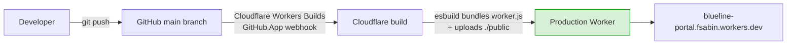

# 12. Build, Deployment, and Infrastructure

---

## How a deploy happens



**Pushing to `main` deploys to production.** There is no staging, no approval gate, no test run,
and no manual step. Typical time to live: **1-2 minutes.**

> ### There is no `.github/workflows` directory, and its absence does not mean "no CI"
>
> Deployment is configured **dashboard-side** via the Cloudflare Workers Builds GitHub App, so it
> leaves no trace in the repository. Concluding "there is no auto-deploy" from the missing CI
> directory is a documented past mistake that led to advice to run `wrangler deploy` — which
> cannot work from the original developer's machine. `gh run list` shows only unrelated GitHub
> Pages runs; ignore them.

## Build

There is no build script, no bundler config, and no `package.json`. Cloudflare's build step runs
`esbuild` over `worker.js`, following the two relative imports:

- `./compliance-seed.js`
- `./agreement-pdf-worker.js` -> which imports `../vendor/pdf-lib.esm.min.js`

The vendored pdf-lib is a real ESM build with all its own dependencies already inlined, so
esbuild resolves it by walking a relative path on disk with **no `node_modules` required**. This
is why `worker.js:1-9` insists the import must stay relative and must never become a bare
specifier like `from 'pdf-lib'`. **Changing that import breaks the deploy.**

`./public` is uploaded as static assets.

## Verifying a deploy landed

You cannot rely on GitHub Actions status (there is none). Confirm by fetching the live site and
grepping for a marker you just changed:

```bash
curl -sL https://blueline-portal.fsabin.workers.dev/admin/settings.html | grep -c "SOME_NEW_CONSTANT"
```

Notes:
- Assets and `worker.js` deploy **atomically as one unit**, so an asset-visible marker also
  confirms backend changes landed.
- `/admin/<page>.html` **307-redirects** to the extensionless `/admin/<page>`. Use `-L`, or curl
  the extensionless path.
- To confirm a new *endpoint* is registered, check it returns 401/403 rather than **404**:
  ```bash
  curl -s -o /dev/null -w "%{http_code}\n" -X POST \
    https://blueline-portal.fsabin.workers.dev/api/admin/contacts/x%40y.com/portal-reset
  # 401 = route exists; 404 = not deployed
  ```

## Hosting and infrastructure

| Aspect | Value | Source |
|---|---|---|
| Platform | Cloudflare Workers | `wrangler.toml` |
| Worker name | `blueline-portal` | `wrangler.toml` |
| Live URL | `https://blueline-portal.fsabin.workers.dev` | Verified live |
| Custom domain | **None** | `nslookup` — no `portal.blueline-advisors.com` |
| KV namespace | `PORTAL_KV`, id `dadc7f3c...` | `wrangler.toml` |
| Static assets | `./public` via the assets platform | `wrangler.toml` |
| Cron | `*/1 * * * *` (every 60 seconds) | `wrangler.toml` |
| Observability | Enabled, incl. logs | `wrangler.toml` |
| Regions | Cloudflare global edge | Platform default |
| TLS | Cloudflare-managed | Platform default |
| Secondary Worker | **None** — `agreement-pdf-worker.js` is a *module imported by* `worker.js`, despite its name | `worker.js:9` |

> `agreement-pdf-worker.js` is misleadingly named. It is **not** a separate Cloudflare Worker and
> is not deployed independently. It exports `buildSignedAgreementServer` and
> `resolveClientNameServer`, imported at `worker.js:9`.

### DNS

| Hostname | Resolves to | Relationship |
|---|---|---|
| `blueline-portal.fsabin.workers.dev` | Cloudflare | **The application** |
| `blueline-advisors.com` | Squarespace (`198.185.159.x`) | Firm marketing site — **unrelated to this app** |
| `www.blueline-advisors.com` | `ext-cust.squarespace.com` | Same |
| `portal.blueline-advisors.com` | **Does not exist** | — |

**Adding a custom domain** is a Cloudflare dashboard operation plus a DNS record. Recommended
(security finding M-3): clients currently submit financial documents at a `workers.dev` URL that
looks like a phishing site.

## The cron trigger

```
crons = ["*/1 * * * *"]   # every 60 seconds
```

Calls `scheduled()` -> `handleScheduled(env)` (`worker.js:7901-7916`), which runs exactly two
jobs in **separate try/catch blocks** so one failing cannot skip the other:

1. `syncSharePointContacts(env)`
2. `syncSharePointHouseholds(env)`

Both log success and failure to Cloudflare Logs. Neither alerts.

> **Cost and throttling concern.** Every 60 seconds means ~43,200 invocations/month, each
> performing a full SharePoint list read plus per-record KV reads and conditional writes — mostly
> to detect changes that rarely happen. This is the most likely source of unexpected Cloudflare
> cost or Microsoft Graph throttling.
>
> It also **amplifies the eventual-consistency bug** described in
> [07-data-model.md](07-data-model.md): the tighter the poll, the more likely the pull reads a
> pre-save copy of a record it just pushed and rebuilds from a stale base.
>
> **Recommendation:** relax to `*/5` or `*/15`. No user-visible behaviour depends on
> sub-minute freshness. Verify with the firm that no workflow assumes near-instant SharePoint
> propagation first.

## Environments

| Environment | Exists? | Notes |
|---|---|---|
| Production | Yes | `main` branch |
| Staging / preview | **No** | No `[env.*]` sections in `wrangler.toml`; no preview Worker |
| Local | Yes | PowerShell mock, see [11-local-development.md](11-local-development.md) |

Cloudflare Workers Builds *can* produce preview deployments for non-`main` branches. Whether that
is enabled is **UNKNOWN** (dashboard-side). Worth checking — it would provide staging almost for
free.

## Rollback

There is no scripted rollback. Options, best first:

1. **`git revert` and push.** Re-deploys the previous state through the normal path. Takes 1-2
   minutes. This is the intended route.
2. **Cloudflare dashboard rollback.** Workers keeps prior deployments; Deployments -> select a
   previous version -> Rollback. Faster than a rebuild and works when the repo is in a bad state.
3. **Roll forward.** Often correct for a small bug.

> **Rollback does not undo data changes.** Code rollback leaves KV exactly as the bad version
> left it. If a bad deploy corrupted or deleted records, **there is no backup to restore from**
> (security finding C-1). Treat any data-mutating deploy as one-way.

## Migrations

**There is no migration system** — no versioned schema, no migration runner, no `migrations/`
directory. Because KV is schemaless, "migrations" happen one of three ways:

| Approach | Used for | Example |
|---|---|---|
| **Read-time tolerance** (dominant pattern) | Additive changes | `decryptToObject` passes legacy plaintext through; `recordWorkspace()` defaults a missing `workspace` to Frank; missing `assignments:` means "all visible" |
| **One-off script** | Bulk data reshaping | `scripts/add-compliance-area.js` — already applied, do not re-run |
| **Lazy migrate-on-read** | Structural changes | `team_roster` members converted to custom board lists on first read |

**Preferred approach for new changes: read-time tolerance.** Write new fields optimistically and
default them when absent. Avoid bulk rewrites — there is no transaction and no backup.

## Post-deploy steps

Normally none. After specific change types:

| Change | Follow-up |
|---|---|
| Edited `shared.js` / `shared.css` | **Bump the `?v=` cache-buster in all 8 admin pages.** Currently `?v=20260817-6`. |
| Added/changed a secret | Takes effect immediately, no redeploy needed |
| Changed `DATA_ENCRYPTION_KEY` | **Do not**, without a re-encryption migration |
| Added a route | Verify it returns 401/403 not 404 (see above) |
| Changed `ADMIN_ACCOUNTS` | Confirm the corresponding `ADMIN_PASSWORD_*` secret exists, or that account is locked out |
| Changed the SharePoint field map | Watch Cloudflare Logs for one cron cycle |

## Secrets management

Set via dashboard or `wrangler secret put <NAME>`. Write-only — values cannot be read back.
**Record them in the firm's password manager at the moment of setting.** Full inventory in
[10-configuration.md](10-configuration.md).

`wrangler` will not install on win32-arm64, so on the original developer's machine all secret
changes must go through the dashboard.

## What is missing from this pipeline

Honest gaps, roughly in priority order:

| Gap | Consequence |
|---|---|
| No automated test run before deploy | Regressions reach clients before anyone notices |
| No staging environment | Every change is tested in production |
| **No database backup** | See security finding C-1. The most serious gap here. |
| No health check or uptime monitoring | An outage is discovered by a user reporting it |
| No alerting on cron failure | SharePoint sync can be broken for days silently |
| No deploy notifications | No record of who deployed what, when, outside git |
| No custom domain | Client-trust problem (M-3) |
| No IaC for Cloudflare config | Bindings are in `wrangler.toml`, but cron/build/domain settings live in the dashboard and are undocumented outside these notes |
