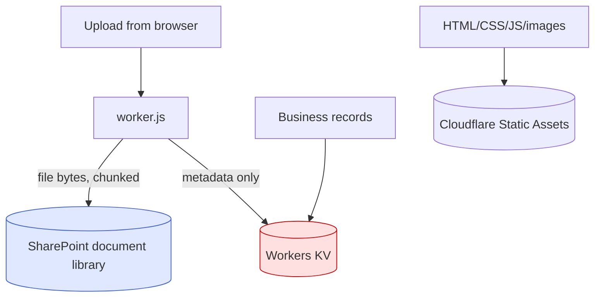
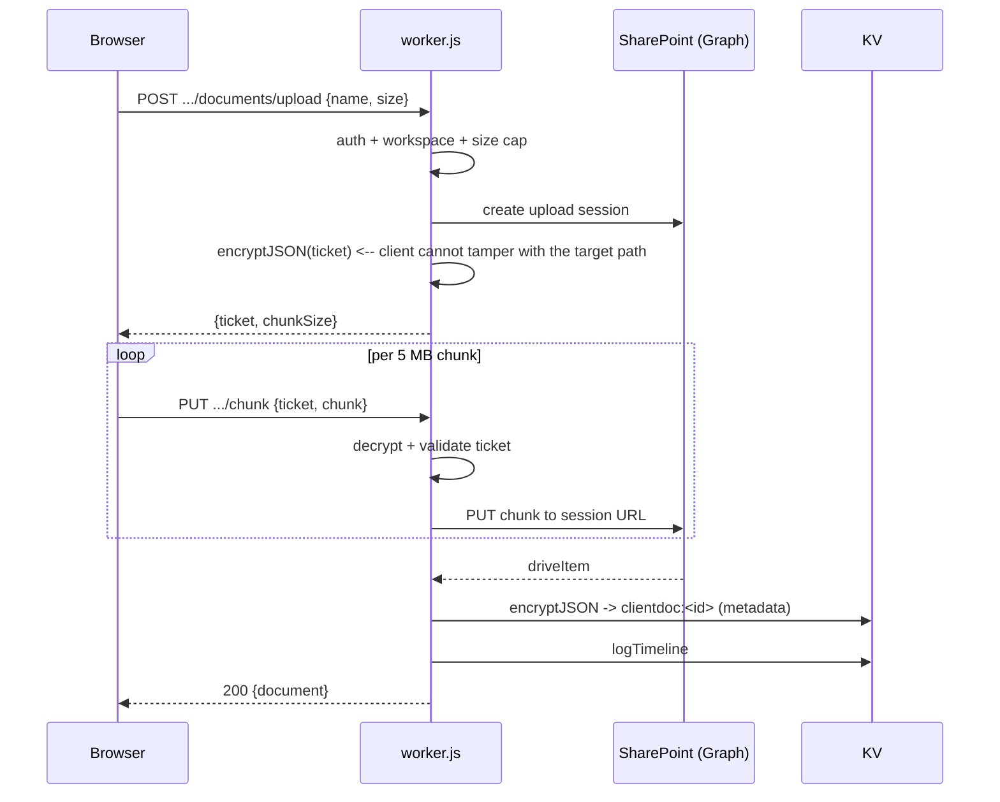
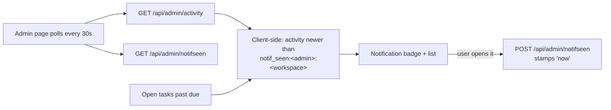

# 13. Storage, Email, and Notifications

---

## Storage: three tiers

| Tier | Holds | Provider |
|---|---|---|
| **Cloudflare KV** (`PORTAL_KV`) | All business records, sessions, audit log, document *metadata* | Cloudflare |
| **SharePoint document libraries** | The actual file bytes for client documents and the learning library | Microsoft 365 |
| **Cloudflare Static Assets** | The application's own HTML/CSS/JS/images from `./public` | Cloudflare |

**There is no Cloudflare R2 bucket, no S3, and no other blob store.** File bytes never enter KV.

## SharePoint libraries

| Library | Env var | Max file | Chunk |
|---|---|---|---|
| Client documents | `SHAREPOINT_CLIENT_DOCS_LIST_ID` | 250 MB (`CLIENT_DOC_MAX`) | 5 MB |
| Learning / SOP library | `SHAREPOINT_LEARNING_LIST_ID` | 2 GB (`LEARNING_MAX_UPLOAD`) | 5 MB |

The 250 MB cap is commented as deliberate: *"statements and scans, not video"*
(`worker.js:5461`). Chunk size must remain a multiple of 320 KiB — a Graph requirement, noted at
`worker.js:3666` and `5460`. **Do not change it to a round number.**

### Upload flow

**The upload ticket is itself encrypted** (`worker.js:3775`, `5776`) — a genuinely good design
choice, since the ticket carries the destination path and an unencrypted one would let a client
redirect the write.

### Permissions and visibility

| Rule | Where |
|---|---|
| Clients see **only their own uploads**, never advisor attachments | `handleGetClientDocuments` |
| Advisors see everything in their workspace | `handleAdminListClientDocs` + workspace filter |
| The Worker acts as a single application identity in SharePoint | Client-credentials token — no per-user impersonation |

Because Graph access is application-scoped, SharePoint's own per-user permissions are **not** the
enforcement layer. All access control happens in `worker.js`. A path-construction bug could in
principle reach other tenant content — see [14-security-review.md](14-security-review.md).

### Failure and retry behaviour

| Failure | Behaviour |
|---|---|
| Session creation fails | 500, no partial state |
| A chunk fails | Upload aborts. **No resume, no cleanup** — a partial file may remain in SharePoint. |
| Final commit fails | File may exist in SharePoint with **no** `clientdoc:` metadata -> invisible in the app |
| Graph token expired | Caught; token re-fetched on next call |
| Undecryptable ticket | 500; restart the upload |

> **There is no retry logic anywhere in the upload path**, and no reconciliation between
> SharePoint contents and `clientdoc:` records. Orphaned files are possible in both directions
> (file without metadata after a failed commit; metadata without file if someone deletes from
> SharePoint directly). Nothing detects either. A reconciliation report would be a sensible
> addition.

### Known operational gotcha

**Word locks `.docx` files while they are open**, which makes uploads of an open document fail.
Not a code bug — tell users to close the file first.

## Email

> ### The application never sends email. At all.

No SMTP, no SendGrid/Postmark/SES/Resend, no `Mail.Send` Graph call, no templates, no queue.
Searching for outbound mail returns nothing.

**Consequences by feature:**

| Feature | How it works without email |
|---|---|
| Client registration invite | Advisor generates a link and delivers it **out of band** (the page opens it in a new tab; in practice copy/paste or phone) |
| Client password reset | Advisor copies the link from a modal and sends it themselves |
| New staff account | Password handed over directly — *"Give them the password directly — they'll set up two-factor on first sign-in"* (`settings.html`) |
| Task/meeting reminders | None. Nothing is pushed anywhere. |
| Document request notification | None. The client sees it next time they log in. |
| Compliance due-date reminders | Only via the **Outlook calendar push**, not email |
| Alerting on failures | None |

**This is a deliberate simplification, not an oversight** — and it has a real security upside
(no email-based account takeover vector, no deliverability/spoofing surface). But it means every
client-facing notification depends on an advisor manually doing something, and there is no
"forgot password" path a client can self-serve.

### Where email *is* touched: reading only

`GET /api/admin/contacts/:email/emails` -> `handleAdminListClientEmails` calls Graph
`GET /users/{id}/messages` to surface recent correspondence on the contact page. **Read-only.**
This requires an application-scoped `Mail.Read`, which technically grants read access to every
mailbox in the tenant.

## Notifications

**Derived at read time. Nothing is stored, queued, or pushed.**

Two sources (`worker.js:~7853`, and see `STATUS.md`):

1. **Overdue open tasks** — these *nag*: they keep appearing until the task is completed, rather
   than being dismissed by having been seen.
2. **Activity entries newer than the read marker** — dismissed by opening the panel.

The read marker is **per admin per workspace** (`notif_seen:<adminEmail>:<workspace>`), so
switching workspace does not mark the other one's activity as seen.

Also derived, not stored: **Compliance Alerts** are computed client-side from compliance item
state.

### What notifications are not

| Missing | Consequence |
|---|---|
| No email or SMS | Nothing reaches staff who are not looking at the app |
| No browser push / service worker | Same |
| No delivery guarantee | Closing the tab before the poll means you simply never saw it |
| No per-user preferences | Not configurable |
| No notification history | Once the marker moves past an entry, it is gone from the panel (the underlying `activity:`/`timeline:` records remain) |

## Client-side storage

| Key | Scope | Contents | Notes |
|---|---|---|---|
| `blueline_session` | localStorage | `{token, name, email}` | Client portal. Cleared when an advisor-issued invite/reset link is opened. |
| `blueline_admin_session` | localStorage | `{token, email}` | Staff |
| `blueline_admin_workspace:<email>` | localStorage | selected workspace | Sent as `X-Admin-Workspace` |
| `blueline_recent_contacts` | localStorage | last 6 viewed | `RECENT_MAX` |
| `blueline_registration_invite` / `_email` | **sessionStorage** | invite token | Survives reload during multi-step registration |
| *(reset token)* | **module scope only** | reset token | Deliberately not persisted — single-use and short-lived, so surviving a reload adds risk for no benefit |

> Bearer tokens in `localStorage` are readable by any script on the origin, so an XSS becomes a
> session theft. The intended CSP would mitigate this — but it is **not applied in production**
> (security H-1). That interaction is why H-1 is rated High rather than Medium.

## Retention summary

| Data | Retention |
|---|---|
| Business records (contacts, tasks, notes, households, clientinfo, responses) | **Forever** — no TTL, no delete path for several |
| `timeline:<email>:*` | **Forever** (deliberately, unlike `activity:`) |
| `activity:*` | ~13 months |
| `audit:*` | ~13 months |
| Client sessions | 7 days |
| Admin sessions | 12 hours |
| Onboarding records | Live indefinitely; 30-day TTL applied **on soft delete** |
| Invite tokens | 7 days |
| Reset tokens | 24 hours |
| MFA pending tokens | 10 minutes |
| Rate-limit counters | = window |
| Uploaded files | Forever, in SharePoint (subject to any SharePoint retention policy — **UNKNOWN**) |

**No backups of any of it.** See [14-security-review.md](14-security-review.md) C-1.
