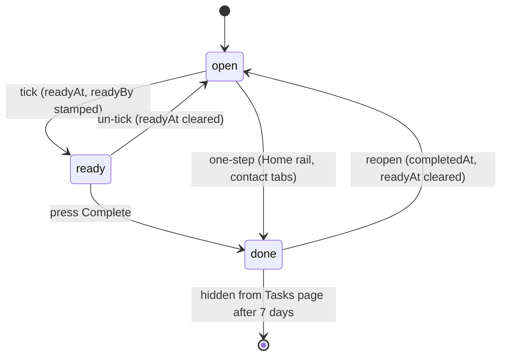

# 16. Business Rules, State Logic, and Dependencies

The non-obvious domain rules. Most are enforced in exactly one place; this document says where.

---

## Dependencies

| Dependency | Version | How it arrives | Notes |
|---|---|---|---|
| `pdf-lib` | Pinned by vendoring | `vendor/pdf-lib.esm.min.js`, relative import | **The only runtime dependency.** ESM build with its own deps inlined. |
| `pdf-lib` (browser) | Pinned by vendoring | `public/assets/vendor/pdf-lib.min.js` | Separate browser build for client-side signing |
| Cloudflare Workers runtime | `compatibility_date 2024-09-23` | Platform | WebCrypto, `fetch`, KV bindings |
| Node.js | Any modern | Dev-only | Only for `scripts/*.js` |
| PowerShell | 5.1+ | Dev-only | Only for `dev-server.ps1` |

**No npm packages are installed at build time.** Supply-chain attack surface is essentially zero.
The trade-off: `pdf-lib` receives no security updates unless someone manually re-vendors it.
Nothing tracks its version — **UNKNOWN** which release is vendored.

## Task state machine

Two-stage completion, deliberately.

| Rule | Where | Why |
|---|---|---|
| Two presses to complete | `operations.html:1316+`, `worker.js:7209-7233` | Completion has side effects that are awkward to undo (client timeline entry, next recurrence). A stray click must not fire them. |
| `readyAt` is stored server-side, not in the page | `worker.js:createTask` | It is a hand-off state — it must survive a reload and be visible to whoever looks next. That is the whole point. |
| Completing implies readiness | `worker.js:7229-7233` | Callers that close in one step (Home rail, contact tabs, where a two-press gate on a compact row would be worse than the misclick it prevents) send only `status:'done'`; the server stamps `readyAt` so the invariant "every completed task records when it was ticked" holds. |
| Un-ticking a done task also withdraws completion | `worker.js:7219-7223` | Otherwise it would be done with no record of ever being ticked. Same rule compliance applies to retracted sign-off. |
| Reopening clears both stamps | `worker.js:7289-7295` | Goes back to needing both presses |
| History is logged once per meaningful event | `worker.js:7298-7302` | One-step completion reads as "completed", not "ticked off" + "completed"; un-ticking a done task reads as "reopened", not both |
| **Completed tasks vanish from the Tasks page after 7 days** | `operations.html` `COMPLETED_VISIBLE_DAYS` + `completedLongAgo()` | View filter, **not** retention. Records stay in KV and remain visible on the contact's Tasks tab, timeline, and search. Age comes from `completedAt`, falling back to `readyAt`; a task with neither stays visible rather than being hidden on a guessed date. |

### Task recurrence

`TASK_REPEATS = ['', 'daily', 'weekly', 'biweekly', 'monthly', 'quarterly', 'yearly']`
(`worker.js:6753`). On `open -> done`, `advanceDue(due, repeat)` (`worker.js:6758`) computes the
next date and `createTask` spawns the next occurrence.

| Rule | Detail |
|---|---|
| Needs a due date | A repeating task with no date has nothing to advance from; no spawn occurs |
| Month-end clamping | JS rolls Jan 31 + 1 month into early March. `addMonths` detects the day changed and calls `setDate(0)` to clamp back to the intended month's last day (`worker.js:6763-6769`). |
| Checklist carries forward **unticked** | It is a fresh occurrence |
| Outlook event ids are **not** copied | Otherwise the new occurrence would overwrite the completed one's calendar entries |
| Calendar owners **are** carried | The next occurrence belongs on the same calendars |
| Logged as `repeat-spawned` with `nextId` | Task history |

## Compliance rules

**Recurring compliance items are materialised, not computed.** Each due date is its own record
with its own pair of sign-offs (`worker.js:4184-4196`).

> Rationale, quoted from the code: it matches how the source workbook already worked — a
> quarterly item appears there as four separate dated rows — and *"it means every occurrence is
> ticked off independently, which is what compliance evidence needs. The alternative (one row plus
> a rule, expanded at render time) would have nowhere to record who signed off which quarter."*

| Rule | Detail |
|---|---|
| **Frequency is descriptive only** | It records how often an obligation comes round. **The app never materialises the next occurrence.** Future due dates arrive by importing a spreadsheet that lists them. Date-stepping machinery was deliberately removed. |
| Frequencies | `Quarterly, Annual, One-time, Ongoing, Monthly, Semi-annual, Weekly` |
| **Exactly six areas, deliberately** | `Governance & Regulatory`, `Trading & Investments`, `Fees & Client Accounts`, `Marketing & Communications`, `Personnel & Ethics`, `Technology, Privacy & Resilience`. The code explains: AI, cybersecurity, privacy, BCP, vendors and device matters all live under Technology/Privacy/Resilience because *"six stable categories people can hold in their head beats fifteen precise ones."* **Do not add a seventh casually.** |
| Requirement levels | `Required`, `Best practice` |
| Two-party sign-off | Owner and reviewer are separate fields per row |
| Area backfill | `COMPLIANCE_AREA_BY_ITEM` maps lowercased item name -> area, used **only** to backfill records written before `complianceArea` existed. New items carry their own. |
| Area is stored, not derived | Explicit requirement that areas are not recomputed from keywords on every page load (`scripts/add-compliance-area.js`) |
| Classification is by item **name**, not id | A recurring obligation appears as several dated rows sharing a name; all must land in the same area |

Seeded from `compliance-seed.js` — 128 rows, ids `c001`-`c128`.

> **Known behaviour that looks like a bug but is not:** compliance items drip-feed on sign-off,
> and seeded rows lack a `seriesId`. The "Open" count therefore stays flat by design rather than
> decreasing as you sign off.

## Contact rules

| Rule | Where |
|---|---|
| Clients vs Prospects is a **filter over one list**, not two stores | `contacts.html`; `scripts/test-prospects.js` asserts every person appears on exactly one side and the counts add up |
| A person falling through both filters would be invisible | Explicitly tested against (`test-prospects.js`) |
| A prospect belonging to a family still nests under it on the Clients side | Like an archived member |
| Statuses | `prospect, onboarding, active, inactive` |
| Categories | `hnw, business, vendor` — app-only, no SharePoint column. `hnw` is the default applied **on read** for records predating the field. |
| Archive is soft | Tasks, notes, timeline, documents all retained |
| Status only moves forward via the wizard | `syncOnboardingContact`: missing/prospect -> onboarding -> active. **An advisor's explicit `active`/`inactive` outranks the wizard.** |
| A contact can be listed in two families | Nothing prevents it; **oldest wins** (`worker.js:1884`) |
| Prospect money figures are estimates | Deliberately **not** summed into `clientInfoDerived()`'s net worth, which describes an actual balance sheet |
| Negative money is allowed | *"an underwater balance sheet is a real answer, not a typo to reject"* |

## Assessment rules

| Rule | Where |
|---|---|
| 17 modules | `MODULE_VALIDATORS` (`worker.js:1270`): 5 FPA (`risk, budget, retirement, networth, compensation`) + 12 category |
| Risk scoring | `RISK_QUESTION_COUNT` answers, each integer 1-5, summed -> `riskCategoryForScore()` -> 5 bands (Conservative, Moderately Conservative, Moderate, Moderately Aggressive, Aggressive) -> `allocationForCategory()` |
| Assignments control visibility | `assignments:<email>`. **Absent/null means "all visible"** — the legacy default. |
| **Unregistered household members get an explicit empty list** | `worker.js:2171-2181`. A household can include people with no portal account; they must not turn a missing assignment record into the legacy "everything visible" default. This is what `test-portal-regressions.js` guards. |
| Shared vs personal modules | `splitModules()`. Shared -> `hhresponses:<householdId>`, personal -> `responses:<email>`. On key collision when merging, **personal wins** (`worker.js:2005`). |
| Household-shared answers: newest wins | `worker.js:1971` |
| Clients never see scored results | Product decision |
| `ONBOARDING_WIZARD_KEY` is assignable | `ASSIGNABLE_KEYS = [...Object.keys(MODULE_VALIDATORS), 'onboardingWizard']` |

## Workspace rules

| Rule | Where |
|---|---|
| Missing `workspace` defaults to Frank | `recordWorkspace()` (`worker.js:319`) — preserves legacy data rather than orphaning it |
| Employee assignment is **exclusive** | Assigned to Frank -> works only in Frank's workspace. Their personal workspace goes dormant (data preserved) and becomes selectable again only when Frank returns them to personal. |
| Jenn, Intern, Eric are permanent shared-view managers | Force-re-added on every workspace-access save; cannot be demoted through the UI |
| Only Frank's workspace can receive members | `handleAdminSaveWorkspaceAccess` rejects any other owner |
| Frank cannot be removed as an admin | `worker.js:233` |
| `__all__` is read-only | GET + 4 allowlisted paths only |

## Board rules

| Rule | Detail |
|---|---|
| The board is **fully manual** | Nothing auto-appears. Unassigned + Completed always exist; everything else you add. Chosen in design. |
| Card placement precedence | `done` -> Completed; else custom-list assignment; else the person list matching `assignee`; else Unassigned |
| Removing a list keeps its tasks | They fall into Unassigned (`columnForTask` maps unknown list/assignee there) |
| Person lists bind to an admin account | Assignee is admin-only — *"only real accounts can own work"*. Board lists are a separate grouping (`task.list`). |
| `team_roster` migrates to custom lists on first read | Legacy path |

## Notification rules

Derived, not stored: overdue open tasks (nag until completed) plus activity entries newer than
`notif_seen:<admin>:<workspace>` (`worker.js:7853`). Nothing is queued or pushed.

## Limits and caps

| Limit | Value | Where |
|---|---|---|
| Task title | 200 chars | `sanitizeTaskFields` |
| Task description | 2,000 | " |
| Task category | `TASK_CATEGORY_MAX_LEN` | " |
| Board list id | 40 | " |
| Admin/contact name | 200 | " |
| `clientinfo` free text | 20-4,000 per field (`importantInformation` 4,000; `medicalConditions` 2,000; `passportNumber` 60) | `CLIENT_INFO_TEXT` |
| Onboarding payload | 100,000 bytes | `ONBOARDING_MAX_BYTES` |
| Signature data URL | 90,000 chars, must be a real PNG | `isValidSignatureDataUrl` |
| Client document | 250 MB | `CLIENT_DOC_MAX` |
| Learning upload | 2 GB | `LEARNING_MAX_UPLOAD` |
| Upload chunk | 5 MB (multiple of 320 KiB, Graph requirement) | `CLIENT_DOC_CHUNK`, `LEARNING_UPLOAD_CHUNK` |
| Audit page size | 10 | `settings.html` |
| Recently-viewed contacts | 6 | `RECENT_MAX` |

## Derived calculations

| Calculation | Where | Notes |
|---|---|---|
| Risk score -> category -> allocation | `worker.js` `riskCategoryForScore`, `allocationForCategory` | 5 bands |
| `clientInfoDerived()` net worth | `worker.js` | Money stored as **numbers** so this is arithmetic, not string parsing. Prospect estimates excluded. |
| Assessment progress (x of N) | `handleAdminClients` + client UI | N = that client's **assigned** module count, not the total |
| Checklist progress | `operations.html:525` | `done/total` + percentage |
| Due urgency | `dueMeta()` in `shared.js` | today / thisWeek / overdue |
| Household aggregate progress | `worker.js:2171-2181` | Union of member assignments, with the unregistered-member rule |

## Idempotency and side-effect guards

| Guard | Purpose |
|---|---|
| `autotask:<rule>:<client>` marker | An automation rule fires once per client, ever |
| Invite/reset tokens consumed **before** the session is issued | Two simultaneous requests cannot both win |
| A rejected password does **not** consume a reset token | A typo must not strand the client on a dead link |
| `outlookEvents{}` stored on the task | Updates patch the existing event instead of duplicating |
| Graph pushes are best-effort with try/catch | A Graph outage can never block saving the underlying record |
| `deleteTimelineRefs` | Deleting a note/task removes its timeline footprint rather than leaving orphans |
