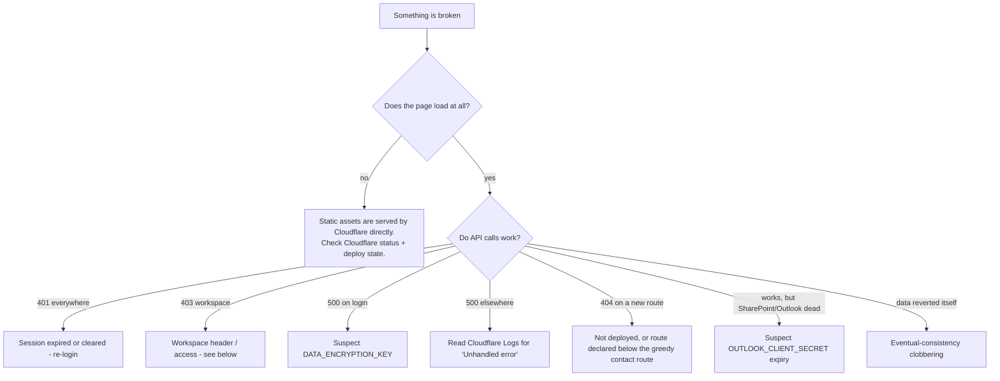

# 18. Troubleshooting Guide

Symptom -> likely cause -> fix. Ordered by how often each is likely to come up.

---

## Quick triage



---

## Startup and local development

### `dev-server.ps1` prints nothing / exits immediately

The script failed to parse. Validate without running:

```bash
powershell -NoProfile -Command "$e=$null; [System.Management.Automation.Language.Parser]::ParseFile((Resolve-Path 'dev-server.ps1').Path, [ref]$null, [ref]$e) | Out-Null; if($e.Count){ $e | ForEach-Object { $_.Message }; exit 1 } else { 'OK' }"
```

Expected healthy output when running:
```
Mock portal server on http://localhost:8787/
  compliance items loaded: 128
```

**Trap:** the parser accepts `//` comments (it treats them as a command invocation), so a
`//`-style comment accidentally added to the PowerShell file passes parsing and **fails at
runtime**. Use `#`.

### `wrangler` will not install

Expected on Windows ARM64 — `workerd` has no `win32-arm64` build. This is not fixable by
retrying. Use `dev-server.ps1`, or run `wrangler` on an x64 machine / WSL2 / a Linux container.

### Port 8787 already in use

A previous mock is still running. Kill the PowerShell process.

---

## Authentication

### A staff member cannot log in — "Invalid email or password"

Check in this order:

1. **Is their `ADMIN_PASSWORD_<NAME>` secret set?** For the three hardcoded accounts
   (`fsabin`, `jyoung`, `intern`), a **missing secret produces exactly this message** — it is
   indistinguishable from a wrong password. `ADMIN_PASSWORD` (the old shared fallback) is
   confirmed absent, so there is no safety net. Check Cloudflare -> Settings -> Variables and
   Secrets.
2. Were they removed as an admin? `admin_disabled:<email>` makes `verifyAdminPassword` return
   false immediately. Check the audit log for `remove-admin`.
3. For KV-backed admins, reset their password from Settings.

### Everyone is locked out with a 500 on login

**Suspect `DATA_ENCRYPTION_KEY`.** `getAdminMfa` decrypts `admin_mfa:<email>` and **throws** if
it cannot — a deliberate fail-closed choice so a key problem can never silently bypass MFA. The
top-level handler turns that into a 500.

- Was the secret changed or removed? If changed, **restore the exact previous value** — do not
  guess. If it is genuinely lost, MFA records are unrecoverable and every admin must have their
  MFA reset by deleting `admin_mfa:<email>` directly in KV.
- Check Cloudflare Logs for the underlying error text.

### A client cannot log in

- Do they actually have an account? `user:<email>` only exists after they complete registration.
  A contact record is not an account. The Contacts page shows **Registered** vs **Not
  registered**.
- Rate limited? 10 attempts / 5 min / IP -> 429.
- Forgot their password? There is **no self-service reset.** An advisor must issue a reset link
  (contact Overview -> Reset password).

### "Session expired" immediately after logging in

- Admin sessions last 12 hours, client sessions 7 days.
- Locally, restarting `dev-server.ps1` wipes all sessions.
- A raw `fetch()` in an admin page (instead of `api()`) that 401s will clear the session and
  bounce the tab to `/`. Use `api()`.

### MFA code is rejected

- Codes are valid for 30 seconds with +/-1 step tolerance. **Check the device clock.**
- Locally, the mock generates a **fresh secret on every login attempt** — you must use the secret
  currently on screen, not one from a previous attempt.
- 10 attempts / 5 min / IP applies to `mfa/verify` too.
- Locked out entirely? Another shared-view manager can reset their MFA from Settings. Last resort:
  delete `admin_mfa:<email>` in KV.

---

## Permissions

### Every admin API call returns 403 "You do not have access to that workspace"

- **Production:** the `X-Admin-Workspace` value is not in the caller's allowed set. Clear
  `blueline_admin_workspace:<email>` from localStorage and reload to fall back to the default.
- **Locally:** this was a real bug in the mock's `Get-AccessibleWorkspaces` (a `, @()` return
  producing a nested array, so `-contains` was always false). **Fixed in `099fa41`.** If it
  reappears, look there first.

### A privileged button is missing from the UI

Expected — the frontend hides controls by role (`boss`, `canDeleteAdmins`). Only Frank sees
"Remove admin". This is cosmetic; the server enforces it independently.

### Records are missing from a listing

Almost always **workspace filtering**. Records carry a `workspace` field; a listing shows only the
active workspace. Shared-firm-view managers can select the combined `__all__` view, but only on
Contacts, Households, Tasks, and Workspaces, and only for reads.

Also check: is the contact **archived**? Archived contacts are hidden from working lists but not
deleted.

---

## Data

### "My change reverted itself about a minute later"

**This is the signature symptom of the SharePoint eventual-consistency bug.** Read
[07-data-model.md](07-data-model.md) and `scripts/test-household-sync.js`.

Mechanism: saving pushes to SharePoint, which bumps that row's `Modified`. The every-minute cron
pull then sees SharePoint as newer, and — because KV is eventually consistent — may read a
**pre-save** copy of the record and rebuild from that stale base, wiping fields SharePoint has no
column for (`keyDocuments`, `kind`, `emailPrimary`, `members`).

Immediate mitigation: re-save. Structural mitigations: relax the cron from `*/1` to `*/5` or
`*/15`; ensure the strip-undefined-before-spreading fix is intact (the test pins it).

### A completed task disappeared

**By design.** Completed tasks age out of the Tasks page after 7 days
(`COMPLETED_VISIBLE_DAYS`). It is a **view filter, not deletion** — the record is still in KV and
still visible on the contact's Tasks tab, in the client timeline, and via search.

### "Warning: N task(s) could not be decrypted"

`readAllEncrypted` counts per-record decrypt failures so one corrupt record cannot blank a whole
listing. Causes: the record was written under a different `DATA_ENCRYPTION_KEY`, or it is
genuinely corrupt. The records are not readable without the original key. Do **not** "fix" this by
overwriting them — that discards data.

### A contact's field keeps getting overwritten

Check whether the field is **SharePoint-owned** (`worker.js:2587-2600`). SharePoint-owned scalars
are overwritten by the newer side. App-only fields (`importantDates`, `archived*`, tags,
workspace, and everything in `clientinfo:`) are never touched by sync.

### A field I added to the UI does not save

The field must be declared in **three** places: `contacts.html` (form), `worker.js` (validation
sanitizer), `dev-server.ps1` (mock). A key registered in the UI but not in the server's sanitizer
is **silently dropped — no error.** See [17-technical-debt.md](17-technical-debt.md) D-7.

---

## APIs

### A new endpoint returns 404 in production

1. Did the deploy land? Check for a marker:
   ```bash
   curl -sL https://blueline-portal.fsabin.workers.dev/admin/settings.html | grep -c YOUR_MARKER
   ```
2. **Is the route declared below `contactMatch` (`worker.js:8309`)?** That route's greedy `(.+)`
   swallows every `/api/admin/contacts/:email/<suffix>` path declared after it. Move yours above.
3. Distinguish "route missing" from "auth rejecting": a registered route returns **401/403**, not
   404.

### An endpoint returns 500

Read Cloudflare Logs — the top-level handler logs `Unhandled error <pathname> <method> <stack>`
before returning the generic message. Common causes: a decrypt failure on a record, a Graph call
throwing inside a path that is not wrapped best-effort, or a `JSON.parse` on a malformed record.

### CORS errors in the browser

Default policy is same-origin only. If serving the frontend from another origin, set
`ALLOWED_ORIGIN` (comma-separated). Only explicitly allowed origins are echoed; there is no
wildcard.

---

## Integrations

### Everything SharePoint/Outlook-related broke at once, CRM still works

**Suspect `OUTLOOK_CLIENT_SECRET` expiry first.** Entra client secrets expire (commonly 6-24
months) and this one secret authenticates *all* Graph access — SharePoint sync, document
upload/download, learning library, calendar push, and email reading.

The failure is logged but **not alerted**, and each feature degrades silently rather than showing
an error. Rotate the secret in Entra, then update it in Cloudflare (takes effect immediately, no
redeploy).

### One SharePoint feature is dead, the rest work

A missing or wrong list id. Every integration gates on its own config and **silently skips** when
unconfigured — you get a missing feature, not an error message.

Use the built-in diagnostics (shared-view managers only):

```
GET /api/admin/sharepoint/site     # resolved site
GET /api/admin/sharepoint/lists    # enumerate lists and their ids
```

These exist precisely so you can resolve ids without the SharePoint admin UI. Compare against
`SHAREPOINT_*_LIST_ID`.

### Calendar events are not appearing in Outlook

1. `outlookConfigured(env)` requires all three of `OUTLOOK_CLIENT_ID`, `OUTLOOK_CLIENT_SECRET`,
   `OUTLOOK_TENANT_ID`. Missing any -> silently skipped.
2. `Calendars.ReadWrite.All` **application** permission with **admin consent** is required.
3. Does the task have `calendarOwners` set? No owners means no push.
4. Push failures are caught and logged, never surfaced — check Cloudflare Logs.

### Clients are not receiving invitation emails

**They never will — the application sends no email whatsoever.** Invite and reset links must be
delivered manually by an advisor. See [13-storage-and-notifications.md](13-storage-and-notifications.md).

### A learning-library tag will not save

Graph cannot reliably write SharePoint **Choice** columns; tags deliberately use a **plain-text**
column. Do not convert it back. `GET /api/admin/learning/fields` reports the resolved column and
whether `allowTextEntry` is set.

Also: **Word locks `.docx` files while open**, which makes uploads fail. Close the file.

---

## Uploads

| Symptom | Cause |
|---|---|
| Rejected immediately | Over the cap: 250 MB client documents, 2 GB learning library |
| Fails partway | A chunk failed. **No resume and no cleanup** — retry from the start; a partial file may remain in SharePoint. |
| File is in SharePoint but not in the app | The final metadata write failed. No `clientdoc:` record -> invisible. No reconciliation job exists. |
| 500 on a chunk | Undecryptable upload ticket — restart the upload |

---

## Build and deployment

### The deploy did not happen

There is **no GitHub Actions workflow** — deployment runs via the Cloudflare Workers Builds
GitHub App, configured dashboard-side. `gh run list` shows only unrelated GitHub Pages runs;
ignore them. Check Cloudflare -> Workers -> blueline-portal -> Deployments for build logs.

### The build fails on the PDF import

`worker.js:1-9` requires the pdf-lib import to stay a **relative path** to
`vendor/pdf-lib.esm.min.js`. A bare specifier (`from 'pdf-lib'`) needs npm resolution, which this
repo has no mechanism for. Restore the relative path.

### Stale JavaScript after a deploy

- Bump the `?v=` cache-buster on `shared.js`/`shared.css` in **all 8** admin pages (currently
  `?v=20260817-6`).
- The intended `Cache-Control: no-cache` **does not apply in production** (security H-1), so this
  matters more than it should. Hard-reload to confirm.

### Two of three tests fail

**Expected on a Windows checkout — line endings, not defects.** See
[15-operations.md](15-operations.md). Fix with a `.gitattributes` containing `* text=auto eol=lf`.

---

## Missing configuration — fast reference

| Missing | Symptom |
|---|---|
| `PORTAL_KV` | Total failure |
| `DATA_ENCRYPTION_KEY` (never set) | **Silent plaintext storage.** No error. |
| `DATA_ENCRYPTION_KEY` (changed/removed after use) | 500 on admin login; "could not be decrypted" warnings |
| `ADMIN_PASSWORD_<NAME>` | That staff member cannot log in; message identical to a wrong password |
| `OUTLOOK_*` | All Graph features silently skipped |
| `SHAREPOINT_<X>_LIST_ID` | That one feature silently does nothing |
| `ALLOWED_ORIGIN` | Only matters for cross-origin front ends |

> **The recurring theme: missing configuration degrades silently.** Almost nothing tells you a
> feature is disabled — it just does not happen. When a feature "does nothing", check
> configuration before reading code.
