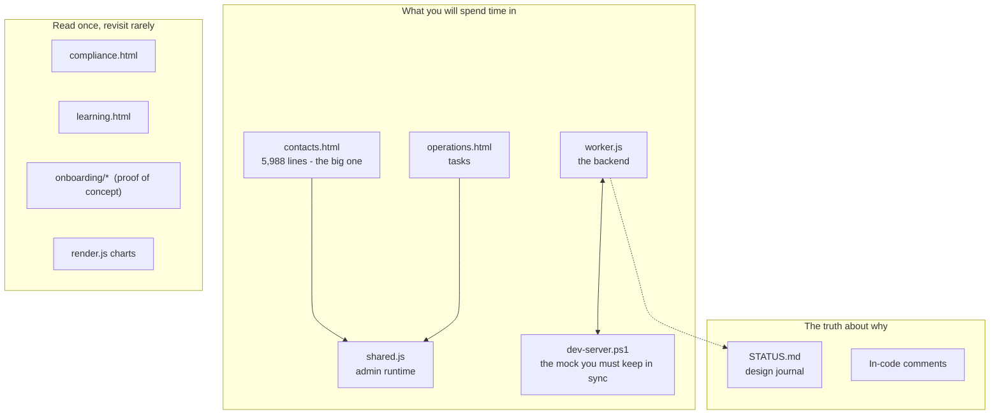

# 21. If You Are the New Developer, Start Here

A concrete learning path. Budget roughly **two days** to be productive and **a week** to be
confident.

---

## Five things to know before you open a file

1. **No build step, no dependencies, no framework.** No `package.json`, no `node_modules`, no
   bundler config. What you read is what runs. Do not go looking for the config that ties it
   together — there isn't one.
2. **`worker.js` is the entire backend.** 8,414 lines, one file, no router library. A long `if`
   chain dispatches 87 endpoints.
3. **`dev-server.ps1` is a second, hand-written implementation of that backend** in PowerShell,
   for local development. Every backend change must be made **twice**. This is the main source of
   "worked locally, broke in production."
4. **The comments are load-bearing.** They routinely record why an obvious-looking alternative
   was rejected. Read them before changing anything; match the density when you write.
5. **`STATUS.md` is a 1,680-line design journal.** Before concluding a decision was arbitrary,
   search it. Most oddities are deliberate and explained.

---

## Day 1 — Orientation

### 1. Get it running (~30 min)

```bash
git clone https://github.com/franksabin/blueline-portal
cd blueline-portal
powershell -NoProfile -ExecutionPolicy Bypass -File dev-server.ps1
```

Expect:
```
Mock portal server on http://localhost:8787/
  compliance items loaded: 128
```

Log in at `http://localhost:8787/admin.html` as `fsabin@blueline-advisors.com` /
`dev-fsabin-pass`. **You will hit a real TOTP enrolment screen** — the mock's MFA is genuine and
regenerates on every restart. Use the TOTP script in
[11-local-development.md](11-local-development.md).

> **If you have an x64 machine or WSL2, use `wrangler dev` instead** and run the real backend.
> Strongly preferred.

Then click through everything: Home, Clients, Prospects, Tasks (board + list), Calendar,
Compliance, Learning, Settings. Note that Tasks and Board are empty until you add board lists,
and that the local store is wiped on restart.

### 2. Read in this order (~3 hours)

| Order | File | What you're looking for | Lines |
|---|---|---|---|
| 1 | `wrangler.toml` | The whole infrastructure surface | 26 |
| 2 | `worker.js:1-140` | Header docs, admin identity, `verifyAdminPassword` | 140 |
| 3 | `worker.js:310-436` | **The workspace/permission model.** Everything depends on it. | 126 |
| 4 | `worker.js:7950-8410` | The route table + `serveAsset` + `scheduled` | 460 |
| 5 | `public/admin/shared.js:1-140` | `api()`, session guard, workspace header | 140 |
| 6 | `worker.js:1077-1176` | The encryption envelope | 100 |
| 7 | `worker.js:565-750` | Client auth: register / login / reset | 185 |

That is ~1,200 lines and gives you the skeleton. **Do not attempt to read `worker.js`
end to end.**

### 3. Then these docs (~1 hour)

[02-architecture.md](02-architecture.md) -> [07-data-model.md](07-data-model.md) ->
[06-auth-and-permissions.md](06-auth-and-permissions.md).

---

## Day 2 — Trace and change something

### 4. Trace one request end to end (~1 hour)

Pick "advisor completes a task" and follow it through every layer:

`operations.html` click handler -> `setDone()` -> `api('/api/admin/tasks/:id')` ->
`shared.js:47` attaching auth + workspace headers -> `worker.js:8319` route match ->
`handleAdminUpdateTask` -> `getAdminEmail` -> `requestedAdminWorkspace` -> `sanitizeTaskFields`
-> status transition -> `logTimeline` -> recurrence spawn -> `encryptJSON` -> KV -> Outlook push
-> response -> UI re-render.

This one flow touches auth, authorization, validation, encryption, history, recurrence, and an
external integration. It is the best single tour of the system.
[08-workflows.md](08-workflows.md) has the diagram.

### 5. Make a deliberately trivial change (~1 hour)

Change the empty-state text on the Tasks list. Then: run it locally, confirm it renders, commit,
push, and **verify it live**:

```bash
curl -sL https://blueline-portal.fsabin.workers.dev/admin/operations.html | grep -c "your new text"
```

The point is to exercise the whole loop — edit, local verify, deploy, live verify — on something
that cannot break anything.

### 6. Then make a real one

Something that requires a backend change, so you feel the double-implementation cost. Use the
recipes in [19-common-tasks.md](19-common-tasks.md).

---

## The five things most likely to bite you

Read these before your first real change.

| # | Trap | Consequence |
|---|---|---|
| 1 | **Route ordering.** `contactMatch` (`worker.js:8309`) has a greedy `(.+)`. | A `/contacts/:email/<suffix>` route declared **below** it is silently treated as a contact upsert. No error. |
| 2 | **You must update `dev-server.ps1`.** | Local testing lies to you. |
| 3 | **New fields need three declarations** (UI, `worker.js` sanitizer, mock). | Missing the server one means the value is **silently dropped**. |
| 4 | **Two timeline label maps** (`shared.js` `TL_LABELS`, `contacts.html` `TIMELINE_LABELS`). | Update one only and the raw slug renders on the contact Timeline tab. |
| 5 | **Every handler does its own auth.** No middleware. | Forget `requestedAdminWorkspace` and you leak across workspaces with no error. |

**The safest habit:** copy the first four lines of an existing handler verbatim.

---

## Mental model



---

## Vocabulary you need immediately

| Term | Meaning |
|---|---|
| **Workspace** | Data-visibility boundary *between staff*, not between customers. Every CRM record has a `workspace` field. |
| **Shared firm view** | Frank's workspace, which designated staff share. Managers of it get elevated rights. |
| **Super admin** | Frank, hardcoded. Only he can delete admin accounts. |
| **Legacy admin** | One of the 3 accounts whose password is a Cloudflare secret, not a KV hash. |
| **FPA** | Financial Picture Analysis — the 5 core assessment modules (of 17 total). |
| **Materialised** | Recurring compliance items exist as one record per due date, not a rule expanded at render time. |
| **Ready / done** | Two-stage task completion. `readyAt` = ticked off; `done` = confirmed. |
| **The mock** | `dev-server.ps1`. |

Full glossary: [22-glossary-and-handoff.md](22-glossary-and-handoff.md).

---

## Do these three things in your first week

Not learning exercises — real gaps, each small, each removing a live risk.

1. **Add `.gitattributes` with `* text=auto eol=lf`.** Fixes the 2 test failures that are pure
   line-ending artefacts, and stops the suite looking broken. ~1 minute, plus re-normalising the
   tree.
2. **Verify `DATA_ENCRYPTION_KEY` is set in Cloudflare.** If it is not, all "encrypted" client
   PII is being stored in plain text with no warning. This is the single highest-value check
   available (security H-2).
3. **Fix the missing security headers** (security H-1) by adding a `public/_headers` file. Verify
   with `curl -I https://blueline-portal.fsabin.workers.dev/` and confirm CSP appears.

---

## What to be careful about

| Area | Why | Read first |
|---|---|---|
| SharePoint sync | Eventual consistency already caused silent data loss | `scripts/test-household-sync.js` — all of it |
| Encryption | Mistakes are irreversible | `worker.js:1077-1176` |
| Task transitions | Interlocking rules | `worker.js:7200-7460` |
| Route table | Silent misrouting | `worker.js:8217-8320` |
| `DATA_ENCRYPTION_KEY` | **Never rotate** without a re-encryption migration | `worker.js:1090-1093` |

---

## Do not "fix" these

They look wrong and are deliberate. Full list in
[17-technical-debt.md](17-technical-debt.md).

- Clients never see their own scored results.
- Outlook events have no attendees (Graph would email real invitations on save).
- Compliance frequency never generates the next occurrence.
- Learning tags use a plain-text column, not a Choice column.
- The kanban board is empty until you add lists.
- `compatibility_date` is old.
- The pdf-lib import is a relative path.
- Completed tasks vanish from the Tasks page after 7 days (view filter, not deletion).

---

## Where to look when stuck

1. **In-code comments** — usually the answer, including the rejected alternative.
2. **`STATUS.md`** — search it before assuming a decision was arbitrary.
3. **`git log --oneline` / `git log -S"someString"`** — commit messages here are unusually
   detailed, often explaining *why* and what was verified.
4. **[18-troubleshooting.md](18-troubleshooting.md)** — symptom-first index.
5. **The audit log** in Settings — who did what, when.
6. **Cloudflare Logs** — the only place unhandled errors surface.
